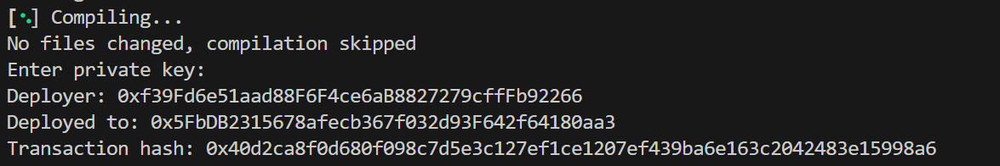

# Foundry Fundamentals

Welcome to Foundry 101. Throughout this course, you will acquire the skills you’ll need to start developing your smart contracts and protocols using the best web3 development tools and frameworks like Chainlink, Alchemy, and Foundry.

### What is Foundry?

Foundry is a relatively new but rapidly growing smart contract development framework known for its efficiency and modularity. The best short description of this powerful tool can be found in the [Foundry Book:](https://getfoundry.sh/)

```
Foundry manages your dependencies, compiles your project, runs tests, deploys, and lets you interact with the chain from the command-line and via Solidity scripts.

```

Please take a moment to bookmark the [Foundry Book:](https://getfoundry.sh/). It is the most comprehensive resource that has the answers to all your questions. It will be handy along the way.

Foundry has numerous pros, such as:

- It leverages Rust for compilation, offering significantly faster build times compared to frameworks like Hardhat or Brownie.

- It's entirely Solidity-based, eliminating the need to learn other programming languages

- Its documentation is comprehensive.

### Our favorite code editor: Visual Studio Code

Throughout this course, we will use Visual Studio Code to write, test, deploy and interact with our smart contracts. Visual Studio Code is a lightweight, powerful source code editor available on Windows, macOS and Linux. It has a comprehensive ecosystem of extensions that makes it one of the best choices when it comes to smart contract development.

# Development environment setup (Mac, Linux)
You know this

# Foundry setup

### Keeping your Terminal Clutter-free

When commands pile up in your terminal, things can get a little overwhelming. Clear it up by simply typing `clear` and hitting `Enter`. Alternatively, use `Command K` if you're on a Mac or `Control K` if you're on Linux or Windows.

Pro tip: This is one of my favorite keyboard shortcuts that I use all the time.

### Understanding the Trash Can and the X

The trash can and the X buttons in your terminal perform distinct functions. Hitting X simply hides your terminal but retains all the previous lines of code. On the other hand, trashing it essentially deletes whatever is running in it. To open up a clean terminal, hit the trash can and then pull it back using `Control+`` or `Terminal > New Terminal`.

### Installing Foundry

With our terminal set and some tips up our sleeve, let's progress to installing Foundry. Navigate to the [Foundry website](https://getfoundry.sh/introduction/installation/) and from the installation tab, fetch the command to install Foundry.

The command would look something like this:

```bash
curl -L https://foundry.paradigm.xyz | bash
```

Hit `Enter` after pasting this in your terminal.

Note: You must have Internet access for this to work as it's downloading Foundry from their official website.

### Verifying Your Installation
After running the `curl` command, an output will appear at the bottom of your terminal indicating the detected shell and the fact that Foundry has been added to your Path.

For instance, the output can be something like this:

```bash
Detected your preferred shell is bashrc and added Foundry to Path run:source /home/user/.bashrcStart
a new terminal session to use Foundry
```

Now, simply type `foundryup` and `Enter` to install and update Foundry to the latest version. Whenever you want to install an update for Foundry, simply run `foundryup` again.

This will install four components: forge, cast, anvil, and chisel. To confirm the successful installation, run `forge --version`. You should get an output indicating the Forge version as shown below.

```bash
Forge version x.x.x
```

### Is Foundry Up Not Running?
Don't panic if this command doesn't run. You might have an issue with your path, and you might need to add Foundry to your path. In case you run into this issue, check lesson 6 of the GitHub repo associated with this course. If no debugging tips are available there, feel free to start a discussion on the course's GitHub repo. Before doing so, make sure to check if a similar discussion already exists.

Try typing `forge --version` into your terminal. Have you received an unwelcome output saying `Forge command found?` This implies that you have to rerun the `source` command that Foundry offered during installation.

Note: Most of the time the `bashrc` file gets loaded automatically. However, if this doesn't apply to your setup, the following lines can add the required command to the end of your `Bash profile`. This will ensure that your `bashrc` file loads by default.

```bash
cd ~
echo 'source /home/user/.bashrc' >> ~/.bash_profile
```

> this depends on your operating system, please check foundry docs to see detailed instructions.

# Quiz 7

**1. What is the main purpose of using a version control system like Git in your projects?**
* *a) To automatically fix bugs in the codebase.*
* *b) To optimize the performance of the final application.*
* *c) To design the visual layout of a user interface*
* *d) To track and manage changes to files, especially source code, over time.*

<details>
  <summary>Click to reveal answer</summary>
  <p>d) To track and manage changes to files, especially source code, over time.</p>
</details>

**2. When setting up credentials in some command-line interfaces, typed passwords may not be visually displayed. What is the typical reason for this behavior?**
* *a) It shows that the password has been automatically generated by the system.*
* *b) It indicates that the system does not actually require a password.*
* *c) It's a security measure to prevent ('shoulder surfing') from seeing the password as it's typed.*
* *d) It means the keyboard has temporarily stopped working correctly.*

<details>
  <summary>Click to reveal answer</summary>
  <p>c) It's a security measure to prevent ('shoulder surfing') from seeing the password as it's typed.</p>
</details>

**3. When working within a third-party cloud development platform, what practice is crucial regarding sensitive credentials?**
* *a) Assume the environment is as secure as your local machine for all data.*
* *b) Use only test or non-production credentials with no real-world value.*
* *c) Store credentials directly within the source code for easy access.*
* *d) Share credentials with team members via the platform's chat feature.*

<details>
  <summary>Click to reveal answer</summary>
  <p>b) Use only test or non-production credentials with no real-world value.</p>
</details>

**4. Which of the following represents a key advantage of utilizing a cloud-based development environment?**
* *a) Complete independence from internet connectivity.*
* *b) Guaranteed lower cost compared to local development.*
* *c) Reduced setup time and standardized environment configuration.*
* *d) Enhanced security for handling production secrets.*

<details>
  <summary>Click to reveal answer</summary>
  <p>c) Reduced setup time and standardized environment configuration.</p>
</details>

**5. If a terminal interface is hidden from view but the session itself is not terminated, what typically happens to processes running within that session?**
* *a) The processes continue to run in the background.*
* *b) The processes are automatically paused until the interface is visible again.*
* *c) The processes are transferred to a new, visible terminal session.*
* *d) The processes are immediately stopped.*

<details>
  <summary>Click to reveal answer</summary>
  <p>a) The processes continue to run in the background.</p>
</details>

**6. In the context of blockchain development toolkits, what function does a component often referred to as a 'local node simulator' (like Anvil, Ganache, or Hardhat Network) typically serve?**
* *a) It manages the secure storage of private keys for deploying contracts.*
* *b) It provides an isolated, high-speed local blockchain environment for development, testing, and debugging of smart contracts.*
* *c) It serves as a code editor specifically designed for writing smart contract languages.*
* *d) It acts as a primary interface for sending transactions to the main public blockchain.*

<details>
  <summary>Click to reveal answer</summary>
  <p>b) It provides an isolated, high-speed local blockchain environment for development, testing, and debugging of smart contracts.</p>
</details>

**7. After installing a new command-line utility, what is a common way to verify that the installation was successful and the tool is accessible system-wide?**
* *a) Executing the command name followed by a flag to request its version information (e.g., `toolname --version`).*
* *b) Manually searching the file system for the tool's primary executable file.*
* *c) Checking the system's control panel for a new entry in installed applications.*
* *d) Rebooting the operating system and checking system logs.*

<details>
  <summary>Click to reveal answer</summary>
  <p>a) Executing the command name followed by a flag to request its version information (e.g., `toolname --version`).</p>
</details>

# Create a new Foundry Project
Reminder: We ran the following commands

```bash
mkdir foundry-f23
cd foundry-f23
```

Now type the following commands:

```bash
mkdir foundry-simple-storage-f23
cd foundry-simple-storage-f23
```

You can always make the cd command faster by pressing the Tab key after you type the first couple of letters from the destination name. Tab lets you autocomplete a lot of commands/paths.

If you type `code .` a new instance of VS Code will open, having the foundry-simple-storage-f23 as the default path.

You can see the contents of this folder on the left sidebar. Try the following command:

```bash
touch randomFile.txt
```

This will create a randomFile.txt

If you want to delete it type:

```bash
rm randomFile.txt
```

The terminal is pretty slick when it comes to moving/opening/creating directories/files, changing paths and generally running things. I recommend going through [this tutorial](https://ubuntu.com/tutorials/command-line-for-beginners#1-overview) if you want to learn how to move extra fast.

### Creating a New Project
The way you [create a new Foundry project](https://getfoundry.sh/guides/project-setup/creating-a-new-project/) is by running the `forge init` command. This will create a new Foundry project in your current working directory.

If you want Foundry to create the new project in a new folder type `forge init nameOfNewFolder`.

Keep in mind that by default `forge init` expects an empty folder. If your folder is not empty you must run `forge init --force`.

Be sure to configure your username and email if you encounter errors related to Git configuration.

```bash
git config --global user.email "yourEmail@provider.com"
git config --global user.name "yourUsername"
```

And that's it, your folder should look as follows:


But what does all this mean?

`lib` is the folder where all your dependencies are installed, here you'll find things like:

- `forge-std` (the forge library used for testing and scripting)

- `openzeppelin-contracts` is the most battle-tested library of smart contracts

- and many more, depending on what you need/install

`scripts` is a folder that houses all your scripts

`src` is the folder where you put all your smart contracts

`test` is the folder that houses all your tests

`foundry.toml` - gives configuration parameters for Foundry

More on these folders and files later.

Please right-click `src`, click on `New File` and name it `SimpleStorage.sol`. Copy the code available [here](https://github.com/Cyfrin/foundry-simple-storage-cu/blob/main/src/SimpleStorage.sol).

One last thing, please delete `Counter.s.sol`, `Counter.sol` and `Counter.t.sol`. These files are a set of basic smart contracts that Foundry provides as a default when you create a new Foundry project.

# Foundry Setup (Windows/WSL)

### WSL setup
Microsoft has significantly improved its development environment support in recent years. However, for _smart contract development_, installing dependencies can sometimes be tricky. To streamline this process, we will use the Windows Subsystem for Linux (WSL): this is a better option because it enables a full-fledged unix-like console on your Windows machine, simplifying the use of tools and utilities commonly found in _unix-based environments_. This setup ensures compatibility with all the code that runs on unix-based systems like macOS and Linux.

To install WSL, you can begin by opening the Windows terminal. On Windows 11, press the Windows key, type "terminal," and hit enter. On Windows 10, you need to install the Windows terminal from the Microsoft Store (select the official app from Microsoft Corporation).

Once installed, open the terminal and type `wsl --install`. This command will initiate the installation process. Afterward, restart your computer. Upon reboot, the terminal will appear again, prompting you to select a Unix username and set a password. WSL will be then successfully installed ✅.

Visual Studio Code
After installing WSL, we need to install a code editor. We will use Visual Studio Code (VS Code), and there are three different methods to install it:

1. Using the Terminal: Utilize `winget`, a package manager pre-installed on Windows 11. Open the terminal and type winget search VS Code to find the desired package. Then, execute `winget install Microsoft.VisualStudioCode` to install VS Code.

2. Via Web Browser: Search for "Visual Studio Code" in your web browser, select the official Microsoft link and download the installer. Follow the prompts, accept the user agreement and customize all the installation options.

3. Using VSCodium: For those who prefer more independence and privacy, there is an open-source alternative called VSCodium. It is similar to VS Code but without Microsoft's telemetry. Download the [VSCodium installer](https://github.com/VSCodium/vscodium/releases) from GitHub and follow its similar installation steps.

Choose the method that best suits your needs. For this course, I will use the official Visual Studio Code from Microsoft.

# VSCode Solidity setup

### Improving Code Format in Visual Studio Code
When you first start, your code might just look like a whole bunch of dull, lifeless, white text.

This can be easily fixed by using one of the `Solidity` extensions. Out of all the Solidity extensions available in the Extensions tab (CTRL/CMD + SHIFT + X) the following are worth mentioning:

1. Solidity by Juan Blanco, the most used Solidity extension out there.

2. Solidity by Nomic Foundation is Patrick's favorite Solidity extension. The rest of the course will be displaying this extension.

3. Solidity Visual Developer is another popular choice.

NOTE: If the code remains unhighlighted despite having installed the extension, there's a quick solution to that. `Press Command + Shift + P` or `Control + Shift + P` on Windows. This opens up the command bar. In the command bar, type in "Settings" and select "Preferences: Open User Settings (JSON)".

If you have nothing in there, create a new setting by typing in:

```solidity
{
  "editor.defaultFormatter": "NomicFoundation.hardhat"
}
```

Use:

`"editor.defaultFormatter": "tintinweb.solidity-visual-auditor"` for Solidity Visual Developer

or

`"editor.defaultFormatter": "JuanBlanco.solidity"` for Solidity by Juan Blanco

### Other interesting extensions
In the previous lesson, we mentioned a file called `foundry.toml`. This also has an extension that formats it to make it easier to read. Please install [Even Better TOML](https://marketplace.visualstudio.com/items?itemName=tamasfe.even-better-toml).

Another indispensable extension is [Inline Bookmarks](https://marketplace.visualstudio.com/items?itemName=tintinweb.vscode-inline-bookmarks).

The Inline Bookmarks plugin facilitates bookmarking the actual code. The extension can be used for document review, auditing, log analysis, and keeping track of development notes and to-do lists. You may share your notes and bookmarks with others with ease because they are saved with your files.

The following default trigger words/tags are configured by default:

```solidity
@todo - (blue) General ToDo remark.
@note - (blue) General remark.
@remind - (blue) General remark.
@follow-up - (blue) General remark.
@audit - (red) General bookmark for potential issues.
@audit-info - (blue) General bookmark for information to be noted for later use.
@audit-ok - (green) Add a note that a specific line is not an issue even though it might look like.
@audit-issue - (purple) Reference a code location an issue was filed for.
```

You can fully customize the colors!

Remember these! They will be very handy in developing and especially in auditing projects.

More details are available [here](https://github.com/tintinweb/vscode-inline-bookmarks).

Next comes the fun part! Let's compile our contract using Foundry!

# Compile a smart contract using Foundry

Open a new terminal. Type in `forge build` or `forge compile` to compile the smart contracts in your project.

Once the compiling is finished, you'll see some new folders in the Explorer tab on the left side. One of them is a folder called out. Here you'll be able to find the [ABI](https://docs.soliditylang.org/en/latest/abi-spec.html) of the smart contract together with the [Bytecode](https://www.geeksforgeeks.org/solidity/introduction-to-bytecode-and-opcode-in-solidity/) and a lot of useful information.

The cache folder also appears. Generally, this folder is used to store temporary system files facilitating the compilation process. But for this course, you can safely ignore it.

### More terminal wizardry
Throughout your solidity development/audit journey you will type a lot of terminal commands, every time to make a change that you want tested you'll probably have to rerun the `forge build` then maybe you test it with `forge test` or run a script with `forge script` and many more. Typing all these over and over again is inefficient and time-consuming. The better way is to use the `up` and `down` arrow keys. The up and down arrow keys to cycle through the recent commands.

Ok, cool! We learned how to compile a contract, but how does one deploy a smart contract?

# Quiz 13

**1. When editing text files within a VS Code, how is the status of unsaved modifications commonly indicated?**
* *a) The background color of the editor changes intensity.*
* *b) An audible alert sounds periodically.*
* *c) A dot appears next to the filename.*
* *d) The file automatically closes after a period of inactivity.*

<details>
  <summary>Click to reveal answer</summary>
  <p>c) A dot appears next to the filename.</p>
</details>

**2. What role does a configuration file (e.g., `foundry.toml`, `package.json`) typically play within a software development project?**
* *a) It contains the main executable code of the application.*
* *b) It defines project-specific settings, dependencies, and parameters for the development tools and build process.*
* *c) It primarily serves as documentation for end-users.*
* *d) It stores large binary assets used by the project.*

<details>
  <summary>Click to reveal answer</summary>
  <p>b) It defines project-specific settings, dependencies, and parameters for the development tools and build process.</p>
</details>

**3. Compared to using HTTPS authentication (requiring username/password or tokens), what is a primary advantage of using SSH keys for interacting with remote Git repositories?**
* *a) Automatically compresses repository data more effectively.*
* *b) Often eliminates the need to repeatedly enter credentials for operations like pushing code after initial setup.*
* *c) Enables collaboration features not available with HTTPS.*
* *d) Provides significantly faster data transfer speeds for cloning.*

<details>
  <summary>Click to reveal answer</summary>
  <p>b) Often eliminates the need to repeatedly enter credentials for operations like pushing code after initial setup.</p>
</details>

**4. Applying consistent indentation and spacing rules throughout a codebase primarily helps to:**
* *a) Optimize the code for faster performance.*
* *b) Reduce the number of lines of code required.*
* *c) Guarantee the code is free of runtime errors.*
* *d) Enhance code maintainability and readability for developers.*

<details>
  <summary>Click to reveal answer</summary>
  <p>d) Enhance code maintainability and readability for developers.</p>
</details>

**5. Which component generated during compilation represents the actual code that is stored on the blockchain after the contract deployment process is complete?**
* *a) Initial Bytecode*
* *b) Function Selectors*
* *c) Deployed Bytecode*
* *d) Abstract Syntax Tree (AST)*

<details>
  <summary>Click to reveal answer</summary>
  <p>c) Deployed Bytecode</p>
</details>

**6. When a smart contract is compiled, what standard interface specification is generated to define how applications can interact with it?**
* *a) Contract Deployment Manifest (CDM)*
* *b) Application Programming Interface (API)*
* *c) Application Binary Interface (ABI)*
* *d) Source Code Map (SCM)*

<details>
  <summary>Click to reveal answer</summary>
  <p>c) Application Binary Interface (ABI)</p>
</details>

**7. Compilation tools often generate output files containing contract details. Where are these essential output files, such as the ABI and bytecode, stored within a project structure?**
* *a) In a dedicated output or build artifacts directory.*
* *b) In a temporary system-wide cache folder.*
* *c) Alongside the testing scripts in the project scripts polder.*
* *d) Directly within the main source code directory.*

<details>
  <summary>Click to reveal answer</summary>
  <p>a) In a dedicated output or build artifacts directory.</p>
</details>

**8. What information does the 'bytecode' component of a compilation output primarily contain?**
* *a) A human-readable description of the contract's functions.*
* *b) The low-level instructions executed by the blockchain's virtual machine.*
* *c) Mappings between function names and their memory addresses.*
* *d) Metadata about the compiler version and license.*

<details>
  <summary>Click to reveal answer</summary>
  <p>b) The low-level instructions executed by the blockchain's virtual machine.</p>
</details>

# Deploying a smart contract Locally using Anvil

There are multiple ways and multiple places where you could deploy a smart contract.

While developing using the Foundry framework the easiest and most readily available place for deployment is Anvil.

Anvil is a local testnet node shipped with Foundry. You can use it for testing your contracts from frontends or for interacting over RPC.

To run Anvil you simply have to type `anvil` in the terminal.


You now have access to 10 test addresses funded with 10_000 ETH each, with their associated private keys.

This testnet node always listens on `127.0.0.1:8545` this will be our `RPC_URL` parameter when we deploy smart contracts here. More on this later!

More info about Anvil is available [here](https://getfoundry.sh/anvil/overview#anvil).

Please press `Ctrl/CMD + C` to close Anvil.

Anvil will be used throughout the course to deploy and test our smart contracts, but before that, let's quickly check an intermediary step.

## Configuring MetaMask

To deploy to a custom network (like your localhost), you'll need MetaMask. MetaMask is a popular cryptocurrency wallet and browser extension that allows users to interact with the Ethereum blockchain and its ecosystem.

Follow these steps:

   1. Open MetaMask.

   2. Click the three little dots and select 'Expand View'.

   3. Go to 'Settings', then 'Networks'.

   4. Here, you'll see the list of networks (Ethereum, Mainnet, etc.) with plenty of details about each one. Locate the RPC URL - this is key.

The RPC URL is essentially the endpoint we make API calls to when sending transactions. For every blockchain transaction you execute, you're making an API to whatever is in here.
To send a transaction to your custom blockchain, you need to add it as a network:

   1. Click on 'Add a Network'

   2. Scroll to the bottom of the list of networks.

   3. Hit 'Add a Network manually'.

   4. Enter the details of your local network

   - Network name: Localhost

   - New RPC URL: Ganachehttp://127.0.0.1:7545 or Anvil http://127.0.0.1:8545 (make sure you always add http://) - these two could differ on your machine, please consult the Ganache UI or Anvil terminal for the exact RPC URL.

   - Chain ID: Ganache 5777(sometimes 1337) or Anvil 31337 - these two could differ on your machine, please consult the Ganache UI or Anvil terminal for the exact Chain ID.

   - Currency symbol: ETH

   - Block explorer URL: - (we don't have a block explorer for our newly created blockchain, which will most likely disappear when we close the VS Code / Ganache app)

Great! Now that we configured our local network, the next step is to add one of the accounts available in Ganache or Anvil into our MetaMask. This is done as follows:

   1. Click the account selector at the top of your wallet.

   2. Click Add account or hardware wallet.

   3. Click Import account

   4. You will be directed to the Import page. Paste your Ganache/Anvil private key. Click Import.

**NOTE: Do not use this account for anything else, do not interact with it or send things to it on mainnet or any other real blockchain, use it locally, for testing purposes. Everyone has access to it.**

Next up we shall talk more about adding a new network to MetaMask.

## Adding New Networks Using MetaMask

Conveniently, MetaMask provides an easy way to add EVM-compatible chains. By pre-configuring a host of them, you can add a chain such as the Arbitrum One by simply clicking on the `Networks` button on the top left, then `Add Network` and proceeding to `Add`. The pleasing part is that MetaMask does all the grunt work, filling in all the necessary information for you. A click on Approve Network ensures the successful addition of the network.

Steps:

   1. Click on the Networks button on the top left

   2. Click on Add Network

   3. Choose your desired EVM-compatible chain

   4. Click on Add

   5. After ensuring all necessary information is already filled in, click on Approve Network

But what can you do if the chain you want to add is not pre-configured?

Simple! You employ the same process we just used to add our new Anvil local chain in the previous lesson

# Deploy a smart contract locally using forge

To find out more about forge's capabilities type

```solidity
forge --help
```

Out of the resulting list, we are going to use the `create` command.

Type `forge create --help` in the terminal or go [here](https://getfoundry.sh/forge/reference/forge-create/) to find out more about the available configuration options.

Try running `forge create SimpleStorage`. It should fail because we haven't specified a couple of required parameters:

   1. `Where do we deploy?`

   2. `Who's paying the gas fees/signing the transaction?`

Let's tackle both these questions.

As you've learned in the previous lessons, each blockchain (private or public) has an RPC URL (RPC SERVER) that acts as an endpoint. When we tried to deploy our smart contract, forge tried to use `http://localhost:8545/`, which doesn't host any blockchain. Thus, let's try to deploy our smart contract specifying the place where we want to deploy it.

Please start Ganache and press Quickstart Ethereum. Copy the RPC Server HTTP://127.0.0.1:7545. Let's run our forge create again specifying the correct rpc url.

```solidity
forge create SimpleStorage --rpc-url http://127.0.0.1:7545
```

This again failed, indicating the following:
```
Error accessing local wallet. Did you set a private key, mnemonic or keystore?
```

Try the following command:

```
forge create SimpleStorage --rpc-url http://127.0.0.1:7545 --interactive
```
You will be asked to enter a private key, please paste one of the private keys available in Anvil. When you paste a key you won't see the text or any placeholder symbols, just press CTRL(CMD) + V and then ENTER.

for clearer output try:

```
forge create SimpleStorage --rpc-url http://127.0.0.1:7545 --interactive --broadcast
```

Voila!



From now on, everything we deploy shall be done on Anvil. But if you like Ganache more, feel free to use that.

Do the following:

   1. Run `clear`

   2. Run `anvil`

   3. Create a new terminal by pressing the + button

   4. Copy one of the private keys from the anvil terminal

   5. Run forge create SimpleStorage --interactive --broadcast
    We don't need to specify an --rpc-url this time because forge defaults to Anvil's RPC URL.

   6. Go to the Anvil terminal and check the deployment details:

```solidity
    Transaction: 0x40d2ca8f0d680f098c7d5e3c127ef1ce1207ef439ba6e163c2042483e15998a6
    Contract created: 0x5fbdb2315678afecb367f032d93f642f64180aa3
    Gas used: 357076
​
    Block Number: 1
    Block Hash: 0x85a56c0b8f166e86d1cce65412615e0d9a72972e04b2488023275131ea27330a
    Block Time: "Mon, 15 Apr 2024 11:50:55 +0000"
​```

The more explicit way to deploy using forge create is as follows:

``` solidity
forge create SimpleStorage --rpc-url http://127.0.0.1:8545 --private-key 0xac0974bec39a17e36ba4a6b4d238ff944bacb478cbed5efcae784d7bf4f2ff80 --broadcast
```

We included the --rpc-url to not count on the default and the --private-key to not use the --interactive option anymore.

>> --broadcast option displays output more clearly compared in later forge versions

Pfew! That was a lot, but we learned a very important thing, how to deploy a smart contract on two local blockchains. But what comes next is one of the most important if not the MOST IMPORTANT aspects you will learn here: _Private key safety_.

***

# Practicing Private Key Safety

Having a private key in plain text is extremely bad. The private key(s) we used in the last lesson are well-known keys for local testing, you shouldn't use those on mainnet and keeping them in plain text is ok, but any other private key should be kept hidden, especially your production key or key's associated with accounts that hold crypto.

Moreover, it's very bad to have private keys in bash history (hit the up arrow and see the key you used to deploy).

You can delete your history by typing:

```bash
history -c
```

We will teach you more about how to secure private keys in one of the next lessons.

## Your Safety Promise

It's time now to articulate your promise for maintaining private key safety. Create a file titled Promise.md. In this file, make it a point to write down your promise:

```markdown
I promise to never use my private key associated with real money in plain text.
```

If you feel comfortable doing so, consider tweeting this to affirm and secure your pledge. Make sure to tag @PatrickAlphaC and @CyfrinUpdraft or any other professional in this field to hold yourself accountable.

Hacking private keys is one of the most important reasons people and projects lose absurd amounts. You don't even need to look that deep to find titles like this:

[The Ronin hack](https://www.halborn.com/blog/post/explained-the-ronin-hack-march-2022) - Social engineering of private keys

[Early Crypto Investor Bo Shen Says He Lost $42 Million in Wallet Hack](https://www.bnnbloomberg.ca/early-crypto-investor-bo-shen-says-he-lost-42-million-in-wallet-hack-1.1850446)

[The $477 million FTX hack](https://www.elliptic.co/blog/the-477-million-ftx-hack-following-the-blockchain-trail) where `The new CEO of FTX revealed that private keys allowing access to the firm’s crypto assets were stored in unencrypted form, and a former employee disclosed that over $150 million was stolen from Alameda Research, due to poor security.`

Don't be like that! Maybe you are not holding millions, but what you hold is yours, don't let it become theirs!

In the following lessons, we'll learn how to access RPC URLs for free using Alchemy for any blockchain. We will also delve into exploring safer methodologies for dealing with private keys. Stay tuned!

# Node JS install

- Welcome back! Before we dive deeper into the course material, we need to ensure your development environment is set up correctly. A crucial piece of this setup is installing NodeJS. This lesson will guide you through understanding what NodeJS is, why you need it, and how to install it using the recommended tools.

- Remember the exercise of writing down your motivations for taking this course? Actively engaging with tasks like that often correlates with greater success, both in this course and in your broader journey within the industry. Keep that momentum going as we tackle this essential setup step.

## Leveraging AI for JavaScript Learning

- Throughout this course, we will be working extensively with JavaScript. If you're new to JavaScript or encounter concepts you don't fully grasp, remember that Artificial Intelligence (AI) tools are exceptionally proficient with this language.

- Don't hesitate to use AI assistants like DeepSeek (chat.deepseek.com), Claude, or others to ask questions, understand code snippets, or even generate basic examples. For instance, asking an AI to "write a basic javascript codebase that will tell me the square root of a number" yields quick and useful results.

- Beyond AI, utilize all available resources: Google, Reddit, the course discussion forums, and any other help channels provided. Strive to understand every single line of code presented. If something is unclear, ask questions until it makes sense. This foundational understanding is critical.

## What is NodeJS?

- We will heavily rely on a technology called NodeJS, which you can find at `nodejs.org`. NodeJS is formally defined as a "JavaScript runtime environment." While this terminology might seem a bit confusing initially, the core concept is straightforward.

- The JavaScript code that runs directly within your web browser (like Chrome, Firefox, etc.) operates in the browser's built-in environment. It "just works" when embedded in a webpage. However, if you want to run JavaScript code directly on your computer – perhaps as a standalone script or to power a server – you need a different environment capable of executing that code outside the browser context.

- This is where NodeJS comes in. It provides the necessary "runtime environment" to execute JavaScript files locally or on a server. Therefore, installing NodeJS is a mandatory prerequisite for proceeding with the course modules that involve running JavaScript code outside of a web browser.

## Installing NodeJS via NVM and PNPM

Installing development tools can sometimes be the most challenging part of getting started. If installing NodeJS or other tools like VS Code takes time – even a full day – don't get discouraged. Patience is key during this setup phase.

We will perform the installation using the terminal, which is conveniently integrated into Visual Studio Code (VS Code).

   1. Navigate to the Official Source: Open your web browser and go to the official NodeJS website's download page: `nodejs.org/en/download`.

   2. Select Your Operating System: Choose the appropriate operating system (macOS, Windows, Linux).

  - Important Windows Note: If you are using Windows, it is highly recommended that you use the Windows Subsystem for Linux (WSL). If you are using WSL, select the Linux installation instructions on the NodeJS website.

  -  For macOS or native Linux environments, select the corresponding instructions.

   3. Choose the Installation Method: The website will present different ways to install NodeJS. We strongly recommend using NVM (Node Version Manager). NVM is a tool that makes it easy to install and switch between different versions of NodeJS, which is incredibly helpful in development. Select the NVM option.

   4. Select the Package Manager: NodeJS comes with a default package manager called npm. However, for this course, we recommend using PNPM. On the installation instructions page, ensure you change the package manager selection from the default (`npm) to `pnpm`.

   5. Execute the Installation Script: Based on your selections (OS, NVM, PNPM), the website will generate a command-line script. Carefully copy this entire script.

   6. Run in VS Code Terminal: Go back to VS Code, open the integrated terminal (usually via the Terminal menu -> New Terminal), paste the copied script into the terminal, and press Enter/Return to execute it. This script will typically download and run the NVM installer, then use NVM to install the recommended NodeJS version, and finally configure PNPM.

Follow the specific instructions provided by the script. This might involve one or more commands to copy and paste.

## Verifying Your Installation
After the installation script finishes, there's a crucial step:

   1. Restart Your Terminal: Close your current terminal session in VS Code (you can often click the trash can icon associated with the terminal panel) and then open a new one (Terminal -> New Terminal). This ensures that your system recognizes the newly installed software and any changes made to your system's environment paths.

   2. Check Node Version: In the new terminal window, type the following command and press Enter:

```bash
node --version
```

    You should see a version number printed, such as v22.x.x (the exact version depends on the LTS version recommended by nodejs.org at the time of installation).

   3. Check PNPM Version: Next, type the following command and press Enter:

```bash
    pnpm --version
```

    You should see another version number printed, for example, 10.x.x.

If both commands successfully output version numbers, congratulations! You have successfully installed NodeJS and PNPM using NVM.
Additional PNPM Resource

If you encounter issues specifically with PNPM or want to learn more about its installation options, you can refer to its official documentation: `pnpm.io/installation`.

With NodeJS installed, your development environment is one step closer to being ready.

# Javascript Fundamentals Refresher

Before diving into the complexities of web3 development, it's crucial to have a solid grasp of JavaScript fundamentals. This lesson provides a quick refresher on core concepts, assuming you have NodeJS and npm installed. We'll use Visual Studio Code (VS Code) as our editor and run JavaScript directly from the terminal. If you're already comfortable with basic JavaScript, feel free to skip this section.

## Setting Up and Running Your First JavaScript File

First, ensure you are working within your project directory (e.g., `full-stack-web3-cu`).

   1. Create the File: In VS Code, right-click within the file explorer pane in your project folder and select "New File". Name this file `mycode.js`.

   2. Run the File: Open your terminal within VS Code (or a separate terminal navigated to your project directory). To execute your JavaScript file using NodeJS, use the following command:
   
```bash
    node mycode.js
```

   - Important: You must be in the same directory as `mycode.js` when running this command. You can use commands like `ls` (Linux/macOS) or `dir` (Windows) to list the files in the current directory and confirm `mycode.js` is present.

## Displaying Output with console.log

The `console.log()` function is essential for viewing output and debugging your code. It prints messages or the values of variables to your terminal.

```javascript
// Prints the string "hi" to the terminal
console.log("hi");
​
// Prints the string "bye" to the terminal
console.log("bye");
```

Run `node mycode.js` after adding this code (and saving the file!) to see the output.

## The Importance of Saving Your Code

VS Code indicates an unsaved file with a white dot next to the filename in its tab. Crucially, any changes you make to your code will not be reflected when you run the file unless you save it first.

  - Use Cmd+S (Mac) or `Ctrl+S` (Windows/Linux), or go to File -> Save.

  - If you run `node mycode.js` with unsaved changes, you'll see the output from the last saved version. Save the file, then run the command again to see the updated output.

## Understanding Basic JavaScript Data Types

JavaScript has several fundamental data types. Here are the key ones we'll cover now:

1.  String: Represents textual data. Always enclose strings in single (') or double (") quotes.

   - Examples: `"hello world"`, `'JavaScript'`, `"123"` (this is a string, not a number).

2.  Number: Represents numerical data (integers or decimals). Do not use quotes.

   - Examples: `25`, `16`, `3.14`, `0`.

3.  Boolean: Represents a logical value, either true or false. Do not use quotes.

   - Examples: `true`, `false`.

You can check the data type of a value or variable using the typeof operator:

```javascript
// Examples of checking data types
const message = "hello";
console.log(typeof(message)); // Output: string
​
const isLoggedIn = false;
console.log(typeof(isLoggedIn)); // Output: boolean
​
const userAge = 25;
console.log(typeof(userAge)); // Output: number
​
const isFalseString = "false"; // Note the quotes
console.log(typeof(isFalseString)); // Output: string
​
const isOneNumber = 1; // Note no quotes
console.log(typeof(isOneNumber)); // Output: number
```

  - Note: JavaScript is case-sensitive. The operator is typeof, not typeOf. Typos like this will cause errors.
  
## Storing Data with Variables: let vs. const

Variables are used to store data values under a specific name, allowing you to reuse and manipulate data easily. JavaScript provides two primary ways to declare variables: `let` and `const`.

1. `let`: Declares a variable whose value _can_ be changed (reassigned) later in the code.

```javascript
    let myVariable = "initial value";
    console.log(myVariable); // Output: initial value
    ​
    myVariable = "new value"; // Reassigning the variable
    console.log(myVariable); // Output: new value
```

2. `const`: Declares a variable whose value cannot be reassigned after it's initially set. It represents a constant value. Attempting to reassign a `const` variable will result in an error.

```javascript
    // Working example
    const fixedValue = "this cannot change";
    console.log(fixedValue); // Output: this cannot change
    ​
    // Example causing an error
    const myConstant = "hello";
    console.log(myConstant); // Output: hello
    // The next line will cause an error if uncommented and run:
    // myConstant = "goodbye";
```

   If you attempt to reassign a `const` variable, NodeJS will throw an error similar to this:
    `TypeError: Assignment to constant variable`.

- Choose const by default unless you specifically know you'll need to reassign the variable, in which case use let. This helps prevent accidental changes to values that should remain constant.

## Adding Notes with Comments

Comments are lines in your code that the JavaScript interpreter ignores. They are used to add explanations, leave notes for yourself or others, or temporarily disable lines of code without deleting them.

   - Syntax: Single-line comments start with //. Everything after // on that line is ignored.

```javascript
// This is a single-line comment explaining the code below.
console.log("This line will run.");
​
// The following line is commented out, so it won't execute:
// console.log("This line will NOT run.");
​
// Comments can contain anything:
// asdfkljhasdflkjh23498hasdlkjf
​
// Use comments to clarify complex logic
const taxRate = 0.08; // 8% sales tax rate
​
// Tip: In VS Code, select lines and use Cmd+/ (Mac) or Ctrl+/ (Win/Linux)
// to quickly toggle comments on/off.
```

## Creating Reusable Code Blocks with Functions

Functions allow you to group a block of code that performs a specific task. You define the function once and can then call (or invoke) it multiple times whenever you need to perform that task, making your code more organized and reusable.

   - Definition Syntax:

```javascript
    function functionName(parameter1, parameter2) {
      // Code to be executed goes here
      // It can use parameter1 and parameter2
    }
```

   - Calling Syntax:
   
```javascript
    functionName(argument1, argument2);
```

Here's a simple example:

```javascript
// Define a function named greet
function greet() {
  console.log("Hello there!");
}
​
// Call the function multiple times
greet();
greet();
greet();
​
// Output:
// Hello there!
// Hello there!
// Hello there!
```

  - Note on Hoisting: JavaScript has a feature called "hoisting" which sometimes allows you to call a function before its definition appears in the code. While this works for standard function declarations, it's generally considered good practice to define functions before you call them for better readability.

## Leveraging AI for Code Generation and Debugging

AI tools like DeepSeek (or others like ChatGPT, Copilot) can be helpful assistants during development.

   1. Code Generation: You can ask the AI to generate boilerplate code or simple functions. For example, you might ask for a JavaScript function to calculate the square root of a number.

   2. Debugging: When you encounter an error message in your terminal (like the `TypeError` from reassigning a `const`), copy the entire error message. Paste it into the AI chat tool and ask questions like:

   - "What does this error mean?"

   - "How can I fix this error in my code?"

   - `"[Paste the error message here]` What is causing this?" (Using backticks helps the AI identify it as code/output).

AI can often quickly explain common errors and suggest fixes, accelerating your learning and debugging process.

## Key Workflow Tips

  - Prerequisites: Ensure NodeJS and npm are installed.

  - Run Location: Always execute `node yourfile.js` from the same directory where `yourfile.js` is located.

  - SAVE YOUR FILES: Remember to save (`Cmd+S/Ctrl+S`) before running node. The white dot in the VS Code tab means unsaved changes.

  - Terminal History: Use the `up` and `down` arrow keys in your terminal to cycle through previous commands, saving you typing.

  - JavaScript Flexibility: Be aware that JavaScript can sometimes be flexible (e.g., optional semicolons, hoisting), which can occasionally lead to confusion. Sticking to consistent practices helps.

This refresher covers the essential JavaScript concepts needed to get started. As we progress, we'll build upon these fundamentals.
