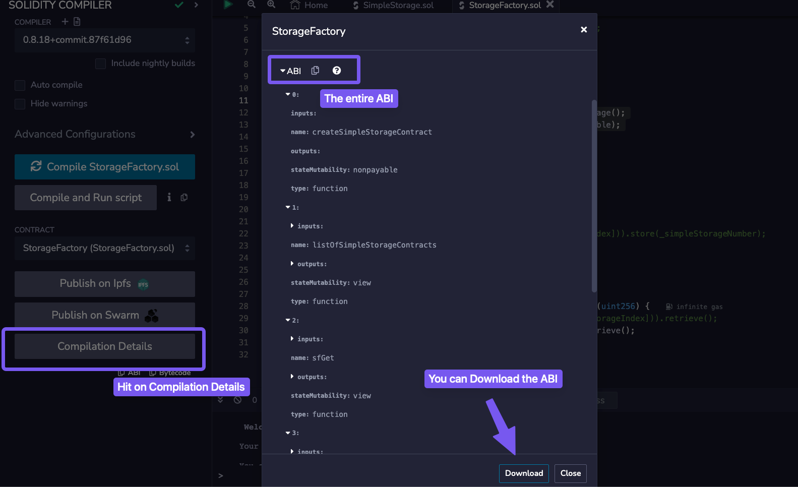

# Storage Factory

## Introduction
You can find the code for this section in the [Remix Storage Factory Github repository](https://github.com/cyfrin/remix-storage-factory-f23). In these nine lessons, we'll work with three new contracts:

1. `SimpleStorage.sol` - the contract we build in the previous section (simpleStorage), with some modifications
2. `AddFiveStorage.sol` - a child contract of `SimpleStorage` that leverages _inheritance_
3. `StorageFactory.sol` - a contract that will _deploy_ a `SimpleStorage` contract and _interact_ with it

## Section Overview
```
contract StorageFactory {
    SimpleStorage[] public listOfSimpleStorageContracts;

    function createSimpleStorageContract() public {};
    function sfStore(uint256 _simpleStorageIndex, uint256 _simpleStorageNumber) public {};
    function sfGet(uint256 _simpleStorageIndex) public view returns (uint256) {}
}
```

- After deploying `StorageFactory` and executing its function `createSimpleStorageContract`, we can observe a new transaction appear in the Remix terminal. It's a **deployment transaction** of the `SimpleStorage` contract, executed by the `StorageFactory` contract.

- It's possible to interact with this newly deployed `SimpleStorage` via the `store` function. We'll do this by using the **`sfStore`** function from the `StorageFactory` contract. This function accepts two parameters: the index of a deployed `SimpleStorage` contract, which will be '0' since we just deployed one contract, and the value of a `favoriteNumber`.

- The **`sfGet`** function, when given the input '0', will indeed return the number provided by the previous function. The **address** of the `SimpleStorage` contract can then be retrieved by clicking on the get function `listOfSimpleStorageContracts`.

## Conclusion
- The `StorageFactory` contract manages numerous instances of an external contract `SimpleStorage`. It provides functionality to deploy new contract instances dynamically and allows for the storage and retrieval of values from each instance. These instances are maintained and organized within an array, enabling efficient tracking and interaction.

# Setting the Project
- In this `StorageFactory` setup, we'll explore what _composability_ means, showing its ability to deploy and interact with external `SimpleStorage` contracts.

- Compossability: The ability for contracts to interact with each other seamlessly

> 👀❗**IMPORTANT**\
> One of the fundamental aspects of blockchain development is the seamless and permissionless interaction between contracts, known as **composability**. This is particularly crucial in decentralized finance (DeFi), where complex financial products interact effortlessly through common smart contract interfaces.

Let's set up the backbone of the code, that contains the function `createSimplestorageContract`. This function will deploy a `SimpleStorage` contract and save the result into a _storage variable_:

```
// SPDX-License-Identifier: MIT
pragma solidity ^0.8.18;

contract StorageFactory {

    function createSimplestorageContract() public {
        // How does StorageFactory know what SimpleStorage looks like?
    }
}
```

We need to establish a connection between the two contracts, since `StorageFactory` needs to have a complete knowledge of `SimpleStorage`. One first approach could be copying the `SimpleStorage` contract above `StorageFactory`.

> 🗒️ **NOTE**\
> It's allowed to have multiple contracts in the same file. As best practice, however, it's recommended to use only one file for each contract

# Deploying a Contract from a Contract
- This covers the process of **programmatically deploying** a `SimpleStorage` contract and saving it to a _storage or state variable_.

## Creating a new variable
- Following the format _type-visibility-name_, we can declare a new _state variable_ of type `SimpleStorage`.

```
// SPDX-License-Identifier: MIT
pragma solidity ^0.8.18;

contract StorageFactory {

	//uint256 public favNum
	//type visibility name
    SimpleStorage public simpleStorage;

    function createSimplestorageContract() public {
        simpleStorage = new SimpleStorage();
    }
}
```

> 👀❗**IMPORTANT**\
> `SimpleStorage` on the left and `simpleStorage` on the right are treated as entirely distinct entities due to their differing capitalization. `Simple Storage` refers to the contract type while `simpleStorage` refers to the variable name.

- When the `new` keyword is used, the compiler recognizes the intention to deploy a new contract instance. After compiling, we can proceed to deploy it.

- In Remix, you'll then notice two buttons: an orange `createSimpleStorageContract` and a blue one, `SimpleStorage`, generated by the `public` keyword. If we call both, first `createSimpleStorageContract` and then `SimpleStorage`, the address that appears below confirms that our `SimpleStorage` contract has been deployed.

# Solidity Imports
- The `import` statement is a more efficientway to arrange and organize the code instead of coping the code directly into the file.

## Importing Code
- The `import` keyword enables a contract to utilize code from other files without needing to include the entire codebase directly within the contract. Here are two of the main advantages that the `import` keyword provides:

1. **No cluttering**: it prevents your current file from being cluttered with numerous lines of code, keeping it clean and organized.
2. **Simplified maintenance**: by keeping the code in separate files, it becomes easier to maintain and update individual components without affecting the entire codebase. For example, if we change some lines inside `SimpleStorage`, we would have also to constantly copy-paste the modified content into `StorageFactory`

```
import "./SimpleStorage.sol";
```

> 🚧 **WARNING**:br
> All the solidity contracts should be compiled together using the _same compiler version_. It's important to ensure **consistency** between compiler versions across files since each one will have its own `pragma` statement.

## Named Imports
- Let's assume for a moment that `SimpleStorage` would contain multiple contracts, e.g. `SimpleStorage`, `SimpleStorage1`, `SimpleStorage2`, which are quite extensive in size. If we import the whole file as we did before, the statement will replace the `import` directive with _all_ the code contained in `SimpleStorage.sol`. This will result in an unnecessary expensive deployment of the `StorageFactory` contract.

- This can be prevented with **named imports**, which allow you to selectively import only the specific contracts you intend to use:

```
import { SimpleStorage } from "./SimpleStorage.sol";
```

You can also use named imports to import multiple contracts:

```
import { SimpleStorage, SimpleStorage1 } from "./SimpleStorage.sol";
```

> 👀❗**IMPORTANT**\
> Try to always default to named imports instead of importing the entire file.

## Conclusion
- The import keyword allows a contract to use code from other files without including the entire codebase. However, it can introduce compilation issues if different compiler versions are used in these files.

# Interacting with contracts ABI
- The `StorageFactory` contract will be upgraded to _keep track_ of all deployed `SimpleStorage` contracts. This will allow us also to _interact_ with each deployed contract individually.

## Storing the deployed contracts
- In the current `StorageFactory` version, every time `createSimpleStorageContract` is called, a new `SimpleStorage` contract is deployed and **overridden** inside the variable `SimpleStorage`. Past deployments are not being tracked down.

- To solve this issue we can create a variable `listOfSimpleStorageContracts`, which is an array of `SimpleStorage` contracts. In this way, whenever a contract is created, it gets added to a dynamic array.

```
SimpleStorage[] public listOfSimpleStorageContracts;
```

- We can then modify the function `createSimpleStorageContract`, pushing the newly deployed contract to this variable.

```
function createSimpleStorageContract() public {
    SimpleStorage simpleStorageContractVariable = new SimpleStorage();
    listOfSimpleStorageContracts.push(simpleStorageContractVariable);
}
```

- In Remix, you can access `listOfSimpleStorageContracts` via the index of type `uint256`, which refers to the **position** of the deployed contract inside the dynamic array.

## Simple Storage interaction
- `StorageFactory` can interact with the deployed contracts by calling their `store` function. To do this we need to create a **function** `sfStore`:

```
function sfStore(uint256 _simpleStorageIndex, uint256 _simpleStorageNumber) public {
    //SimpleStorage store function will be called here
}
```

> 👀❗**IMPORTANT**\
> Every time you have to interact with another contract, you need:
>
> 1. the contract **address**
> 2. the contract **ABI (Application Binary Interface)**: a standardized way for interacting with the binary version of a smart contract deployed on the blockchain. It specifies the functions, their parameters, and the structure of the data that can be used to interact with the contract. It's generated by the compiler.

> 🗒️ **NOTE**\
> If you do not have the full ABI available, a function selector will suffice (see later in the course).

- If you go to Solidity's compile tab, you will find a button that lets you copy the ABI to the clipboard.



> 🗒️ **NOTE**\
> In Solidity, it's possible to **type cast** an _address_ to a type _contract_

- We can now proceed to store a new number on a `SimpleStorage` contract:

```
function sfStore(uint256 _simpleStorageIndex, uint256 _simpleStorageNumber) public {
    listOfSimpleStorageContracts[_simpleStorageIndex].store( _simpleStorageNumber);
}
```

- We can then retrieve the stored value with a _get_ function:

```
function sfGet(uint256 _simpleStorageIndex) public view returns (uint256) {
        // return SimpleStorage(address(simpleStorageArray[_simpleStorageIndex])).retrieve();
        return listOfSimpleStorageContracts[_simpleStorageIndex].retrieve();
    }
```

## Conclusion
The `StorageFactory` contract was able to create a list of `SimpleStorage` contracts, store a variable in each of them and read it back.

***

# Inheritance in Solidity

- The concept of **inheritance** and **overriding** are two powerful tools that allow developers to create more modular, maintainable, and reusable smart contracts. By leveraging these techniques, you can build upon existing contracts and customize their functions.

## Inheritance
- We are going to enhance the `SimpleStorage` contract by adding a new functionality: the ability to add five (5) to the stored `favoriteNumber`. To achieve this, we could duplicate the existing `SimpleStorage` contract and make changes to the new version. However, this approach leads to redundant code. A better practice could be to utilize **inheritance**, which is the mechanism that allows the `AddFiveStorage` contract to derive all the functionalities of `SimpleStorage`.

Let's begin by creating a new file `AddFiveStorage.sol` and name-importing `SimpleStorage.sol`:

```
// SPDX-License-Identifier: MIT
pragma solidity ^0.8.18;
import {SimpleStorage} from "./SimpleStorage.sol";

contract AddFiveStorage is SimpleStorage {} 
```

- The `is` keyword signifies inheritance and links the parent contract `SimpleStorage` to its child contract, `AddFiveStorage`.

## Override and Virtual
- The `AddFiveStorage` contract now inherits all methods from `SimpleStorage`. It's possible to add new functions to it, for example:

```
function sayHello() public pure returns(string memory) {
    return "Hello";
}
```

- We can also modify existing functions from `SimpleStorage` by using the **`override`** keyword. Let's say that we want to modify the `store` function, adding '5' to the favorite number being stored. If we copy the exact signature of the `store` function, an error will occur:

```
function store(uint256 _newFavNumber) public {}
```

```
TypeError: Overriding function is missing "override" specifier.
```

> 🗒️ **NOTE**\
> To override a method from the parent contract, we must replicate the exact function **signature**, including its name, parameters and adding the visibility and the `override` keyword to it:

```
function store(uint256 _newFavNumber) public override {}
```
- Yet, another error will pop up:

```
TypeError: Trying to override a non-virtual function.
```
- To address this, we need to mark the `store` function in `SimpleStorage.sol` as **virtual**, enabling it to be overridden by child contracts:

```
function store(uint256 favNumber) public virtual {
    // function body
}
```

- Finally, we can add the new functionality to the `store` function in `AddFiveStorage`, allowing it to add '5' to the stored `favoriteNumber`:

```
function store(uint256 _newFavNumber) public override {
    favoriteNumber = _newFavNumber + 5;
}
```

## Conclusion
- We utilized inheritance to modify the `SimpleStorage` contract, without rewriting all its code. After deploying the contract `AddFiveStorage` and storing the number 2, it will return the `favoriteNumber` 7. This confirms that the `store` function in `AddFiveStorage` contract successfully overrides the existent `store` function in `SimpleStorage`


# Quiz: Storage Factory Recap
**1. What must be included when overriding a method from a parent contract in Solidity?**
* *a) The function name, return type, and override keyword.*
* *b) The function name, parameters, return type, and virtual keyword.*
* *c) The function parameters, override keyword, and function body.*
* *d) The function name, parameters, visibility, return type, and override keyword.*

<details>
  <summary>Click to reveal answer</summary>
  <p>d) The function name, parameters, visibility, return type, and override keyword.</p>
</details>

**2. How are the keywords override and virtual used together in Solidity?**
* *a) virtual is used to prevent a function from being overridden, while override is used to define new functions that cannot be overridden.*
* *b) override is used in a parent contract to mark functions that can be overridden, while virtual is used in a child contract to override those functions.*
* *c) virtual is used in a parent contract to allow a function to be overridden, while override is used in a child contract to provide a new implementation for that function.*
* *d) virtual is used to declare a function in a child contract, while override is used to make a function in the parent contract final.*

<details>
  <summary>Click to reveal answer</summary>
  <p>c) virtual is used in a parent contract to allow a function to be overridden, while override is used in a child contract to provide a new implementation for that function.</p>
</details>

**3. What does the new keyword tell to the compiler?**
* *a) It tells the compiler to allocate gas for dynamic contract execution within loops.*
* *b) It forces the compiler to overwrite the existing contract in the EVM with the latest bytecode*
* *c) It tells the compiler that a new contract instance is intended to be deployed after compilation.*
* *d) It tells the compiler to allocate memory for complex data types like structs and arrays.*

<details>
  <summary>Click to reveal answer</summary>
  <p>c) virtual is used in a parent contract to allow a function to be overridden, while override is used in a child contract to provide a new implementation for that function.</p>
</details>

# Sections summary and recap
- This section covered how to deploy contracts, how to import and interact with them, and using inheritance to customize their functionalities.

## Deploying and importing
- We delved into the use of the **`new`** keyword to deploy multiple instances of a contract, allowing for the creation of numerous contract instances as needed.

- Contracts can also be **imported**, which is equivalent to copying the code into the file but with the advantage of enhanced code reusability and modularity. It's good practice to use _named imports_, selecting only the contracts we intend to use from the file.

```
import { Contract as MyContract } from './myOtherContract.sol';
```

## Contracts interaction
- Solidity lets you interact with other contracts. To do so we need the contract's address and its ABI (Application Binary Interface):

```
contract AddFiveStorage is SimpleStorage {}
```

## Inheritance and overriding
- A contract can also derive functions from other contracts through **inheritance**. This can be obtained through the `is` keyword.
To explicitly override a function from the parent contract, the `override` keyword is used in the child method. The parent's function must be marked as `virtual` to allow this interaction.

```solidity
//child contract
import './ParentContract.sol';
contract ChildContract is ParentContract {
    function store(uint256 _num) public override {}
}
```

```
//parent contract
function store(uint256 _num) public virtual {
    // function body
}
```

## Conclusion
- In this section, we explored deploying multiple contract instances using the `new` keyword and enhancing code reusability through contract _imports_. We also covered interacting with other contracts using their address and ABI. Additionally, we learned about inheritance and function overriding, allowing derived contracts to customize inherited functionalities.
- 💡 **TIP**\
When you finish a section, take a moment to acknowledge your progress, celebrate it and share your achievements with your community.
