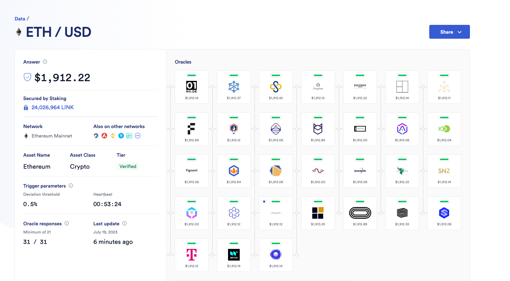
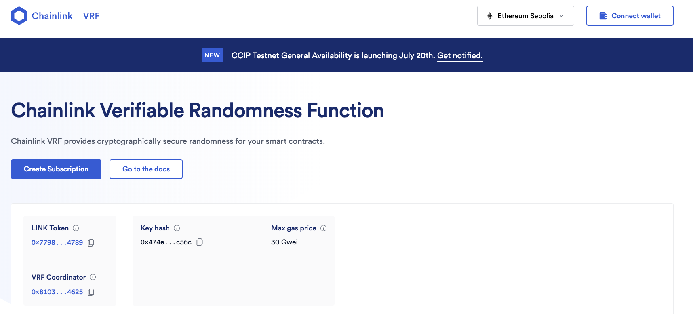

# Fund Me

## Introduction
- In this section, we'll create a _decentralized crowdfunding_ contract

- For this project, we will be using two contracts: `FundMe`, the main crowdfunding contract, and `PriceConverter`. They function much like _Kickstarter_, allowing users to **send** any native blockchain cryptocurrency. They also enable the owner of the contract to **withdraw** all the funds collected. We will then deploy these contracts on a **testnet**.

> 🗒️ **NOTE**\
> Use testnet sparingly. Limiting testnet transactions helps prevent network congestion, ensuring a smoother testing experience for everyone.

## fund and withdraw
- Once `FundMe` is deployed on Remix, you'll notice a set of _functions_, including a new red button labelled `fund`, indicating that the function is _payable_. A payable function allows you to send native blockchain currency (e.g., Ethereum, Polygon, Avalanche) to the contract.

- We'll additionally indicate a **minimum USD amount** to send to the contract when the function `fund` is called. To transfer funds to the `FundMe` contract, you can navigate to the _value section_ of the Remix deployment tab, enter a value (e.g. 0.1 ether) then hit `fund`. A MetaMask transaction confirmation will appear, and the contract balance will remain zero until the transaction is finalized. Once completed, the contract balance will be updated to reflect the transferred amount.

- The contract owner can then `withdraw` the funds. In this case, since we own the contract, the balance will be removed from the contract's balance and transferred to our wallet.

## Conclusion
- These 25 lessons will guide you step-by-step through the implementation of a crowdfunding contract, that supports cryptocurrency contributions and owner withdrawals.

# Project Setup
- Let's begin by coding `FundMe`, a crowdfunding contract allowing users to send funds, which the owner can later withdraw. Before we start, let's clean up our Remix IDE workspace

> 👀❗**IMPORTANT**\
> Before you start coding, try to write down in plain English what you want your code to achieve. This helps clarify your goals and structure your approach.

We want `FundMe` to perform the following tasks:

1. **Allow users to send funds into the contract:** users should be able to deposit funds into the 'FundMe' contract
2. **Enable withdrawal of funds by the contract owner:** the account that owns `FundMe` should have the ability to withdraw all deposited funds
3. **Set a minimum funding value in USD:** there should be a minimum amount that can be deposited into the contract

## fund and withdraw functions
- The FundMe contract will have two primary functions that serve as the main interaction points:

1. **`fund`:** allows users to deposit funds into the contract
2. **`withdraw`:** grants the contract owner the ability to withdraw the funds that have been previously deposited

First, let's code the `fund` function and leave the `withdraw` function commented out for the moment.

```solidity
contract FundMe {
    // send funds into our contract
    function fund() public {}
    // owner can withdraw funds
    /*function withdraw() public {}*/
}
```

***

# Sending Eth through a function
- In this part, we'll explore how to transfer Ethereum (ETH) to a smart contract by creating a `fund` function. This function will require a _minimum amount of ETH_ to ensure proper transaction handling.

## Value and Payable
- When a transaction it's sent to the blockchain, a **value** field is always included in the _transaction data_. This field indicates the **amount** of the native cryptocurrency being transferred in that particular transaction.
For the function `fund` to be able to receive Ethereum, it must be declared **`payable`**. In the Remix UI, this keyword will turn the function red, signifying that it can accept cryptocurrency.

- _Wallet addresses_ and _smart contracts_ are capable of **holding** and **managing** cryptocurrency funds. These entities can interact with the funds, perform transactions, and maintain balance records, just like a wallet.

```solidity
function fund() public payable {
    // allow users to send $
    // have a minimum of $ sent
    // How do we send ETH to this contract?
    msg.value;

    //function withdraw() public {}
}
```

- In Solidity, the **value** of a transaction is accessible through the [`msg.value`](https://docs.soliditylang.org/en/develop/units-and-global-variables.html#special-variables-and-functions) **property**. This property is part of the _global object_ `msg`. It represents the amount of **Wei** transferred in the current transaction, where _Wei_ is the smallest unit of Ether (ETH).

## Reverting transactions
- We can use the`require` keyword as a checker, to enforce our function to receive a minimum `value` of one (1) whole ether:

```solidity
require(msg.value > 1e18); // 1e18 = 1 ETH = 1 * 10 ** 18
```

- This `require` condition ensures that the transaction meets the minimum ether requirements, allowing the function to execute only if this threshold is satisfied. If the specified requirement is not met, the transaction will **revert**

- The require statement in Solidity can include a custom error message, which is displayed if the condition isn't met, clearly explaining the cause of the transaction failure:

```js
require(msg.value > 1 ether, "Didn't send enough ETH"); //if the condition is false, revert with the error message
```

- An online tool like [Ethconverter](https://eth-converter.com/) can be useful for executing conversions between _Ether_, _Wei_, and _Gwei_

> 👀❗**IMPORTANT**\
> 1 Ether = 1e9 Gwei = 1e18 Wei

> 🗒️ **NOTE**\
> Gas costs are usually expressed in Gwei

- If a user attempts to send less Ether than the required amount, the transaction will **fail** and a _message_ will be displayed. For example, if a user attempts to send 1000 Wei, which is significantly less than one Ether, the function will revert and does not proceed.

## Conclusion

- In this lesson, we explored how to use the `value` field of a transaction to transfer Ether to a contract. We also learned how to generate an **error message** when the user sends insufficient Ether to the `FundMe` contract

# Solidity reverts

We will delve into how do _transaction reverts_ work, what is _gas_ where is used.

## Revert

Let's start by adding some logic to the `fund` function:

```solidity
 uint256 public myValue = 1;
 function fund() public {
    myValue = myValue + 2;
 }
```

A _revert_ action **undoes** all prior operations and returns the remaining gas to the transaction's sender. In this `fund` function, `myValue` increases by two (2) units with each successful execution. However, if a revert statement is encountered right after, all actions performed from the start of the function are undone. `myValue` will then reset to its initial state value, or one.

```solidity
 uint256 public myValue = 1;
 function fund() public {
    myValue = myValue + 2;
    require(msg.value > 1e18, "didn't send enough ETH");
    // a function revert will undo any actions that have been done.
    // It will send the remaining gas back
 }
```

## Gas Usage

> 🔥 **CAUTION**\
> The gas used in the transaction will not be refunded if the transaction fails due to a revert statement. The gas has already been **consumed** because the code was executed by the computers, even though the transaction was ultimately reverted.

Users can specify how much gas they're willing to allocate for a transaction. In the case where the `fund` function will contain a lot of lines of code after the `require` and we did indeed set a limit, the gas which was previously allocated but not used will not be charged to the user

> 🗒️ **NOTE**\
> If a transaction reverts, is defined as failed


## Transaction Fields

During a **value** transfer, a transaction will contain the following fields:

* **Nonce**: transaction counter for the account

* **Gas price (wei)**: maximum price that the sender is willing to pay _per unit of gas_

* **Gas Limit**: maximum amount of gas the sender is willing to use for the transaction. A common value could be around 21000.

* **To**: _recipient's address_

* **Value (Wei)**: amount of cryptocurrency to be transferred to the recipient

* **Data**: 🫙 _empty_

* **v,r,s**: components of the transaction signature. They prove that the transaction is authorised by the sender.

During a _**contract interaction transaction**_, it will instead be populated with:

* **Nonce**: transaction counter for the account

* **Gas price (wei)**: maximum price that the sender is willing to pay _per unit of gas_

* **Gas Limit**: maximum amount of gas the sender is willing to use for the transaction. A common value could be around 21000.

* **To**: _address the transaction is sent to (e.g. smart contract)_

* **Value (Wei)**: amount of cryptocurrency to be transferred to the recipient

* **Data**: 📦 _the content to send to the_ _**To**_ _address_, e.g. a function and its parameters.

* **v,r,s**: components of the transaction signature. They prove that the transaction is authorised by the sender.

## Conclusion

**Reverts** and **gas usage** help maintain the integrity of the blockchain state. _Reverts_ will undo transactions when failures occur, while _gas_ enables transactions execution and runs the EVM. When a transaction fails, the gas consumed is not recoverable. To manage this, Ethereum allows users to set the maximum amount of gas they're willing to pay for each transaction.

### 🧑‍💻 Test yourself

**🧑‍💻 Bob sets his gas price to 20 Gwei and his gas limit to 50,000 units. The transaction consumes 30,000 units of gas before a revert occurs. How much ETH will be effectively charged?**

<details>
  <summary>Click to reveal answer</summary>
  <p>
- Gas Price: 20 Gwei
- Gas Consumed (before revert): 30,000 units

Effective Charge = Gas Consumed (before revert) × Gas Price

Effective Charge = 30,000 units × 20 Gwei

1 ETH = 1,000,000,000 Gwei (10^9 Gwei)
So, 1 Gwei = 0.000000001 ETH (10^-9 ETH)

Effective Charge = 30,000 × 20 × 10^-9 ETH
Effective Charge = 0.0006 ETH

**Therefore, Bob will be effectively charged 0.0006 ETH.**

> The gas limit of 50,000 units is the maximum Bob was willing to spend, but since the transaction only consumed 30,000 units before reverting, he is only charged for the gas actually used.

</p>
</details>

***

# Intro to oracles - getting real world price data

With the rapid advancement of blockchain technology and the growing adoption of decentralized finance platforms (DeFi), the necessity to support **multiple digital currencies** has significantly increased. Enabling users to utilize their preferred digital currencies extends market reach and improves the usability of an application.

This lesson will walk you through adding a **currency conversion feature** to the `fundMe` contract and setting **price thresholds** with Chainlink Oracle, a decentralized network for external data.

## USD Values

Currently, our contract will require the transaction value to be greater than _one Ethereum (ETH)_. If we want to give the users the flexibility to spend  5 USD instead, we would need to update our contract. We can begin by specifying the new value with a state variable `uint256 public minimumUSD = 5` at the top of the contract.

```solidity
contract FundMe{

    uint256 public myValue = 1;
   
    function fund() public payable  {
        //Allow users to send $
        // Have a minimum $ sent
        myValue = myValue + 2;
		
        require(msg.value > 1e18, "Didn't send enough eth");
    }
}
```

The next step would be changing the condition inside the `fund` function, to check if the `value` sent is equal to or greater than our `minimumUSD`. However, we are facing a roadblock here: the `minimumUSD` value is in USD while the transaction message value is specified in ETH.

```solidity
contract FundMe{
    
    uint256 public minimumUsd = 5;

    function fund() public payable  {
        //Allow users to send $
        // Have a minimum $ sent
        require(msg.value >= minimumUsd, "Didn't send enough eth");
    }
}
```

## Decentralized Oracles

The USD price of assets like Ethereum cannot be derived from blockchain technology alone but it is determined by the financial markets. To obtain a correct _price information_, a connection between off-chain and on-chain data is necessary. This is facilitated by a _decentralized Oracle network_.

This blockchain limitation exists because of its **deterministic nature**, ensuring that all nodes univocally reach a consensus. Attempting to introduce external data into the blockchain, will disrupt this consensus, resulting in what is referred to as a _smart contract connectivity issue_ or _the Oracle problem_.

For smart contracts to effectively replace traditional agreements, they must have the capability to interact with **real-world data**.

Relying on a centralized Oracle for data transmission is inadequate as it reintroduces potential failure points. Centralizing data sources can undermine the trust assumptions essential for the blockchain functionality. Therefore, centralized nodes are not enough for external data or computation needs. _Chainlink_ addresses these centralization challenges by offering a decentralized Oracle Network.

## How Chainlink Works

Chainlink is a _modular and decentralized Oracle Network_ that enables the integration of data and external computation into a smart contract. When a smart contract combines on-chain and off-chain data, can be defined as **hybrid** and it can create highly feature-rich applications.

Chainlink offers ready-made features that can be added to a smart contract. And we'll address some of them:

* **Data Feeds**

* **Verifiable Random Number**

* **Automation (previously known as "Keepers")**

* **Functions**

## Chainlink Data Feeds

_Chainlink Data Feeds_ are responsible for powering over \$50 billion in the DeFi world. This network of Chainlink nodes aggregates data from various **exchanges** and **data providers**, with each node independently verifying the asset price.



They aggregate this data and deliver it to a reference contract, the **price feed contract**, in a single transaction. Each contract will store the pricing details of a specific cryptocurrency


## Chainlink VRF

The Chainlink VRF (Verifiable Random Function) provides a solution for generating **provably random numbers**, ensuring true fairness in applications such as NFT randomization, lotteries, and gaming. These numbers are determined off-chain, and they are immune to manipulation.



## Chainlink Automation (previously known as "Keepers")

Another great feature is Chainlink's system of _Keepers_. These **nodes** listen for specific events and, upon being triggered, automatically execute the intended actions within the calling contract.

## Chainlink Function

Finally, _Chainlink Functions_ allow **API calls** to be made within a decentralized environment. This feature is ideal for creating innovative applications and is recommended for advanced users with a thorough understanding of Chainlink ecosystem.

## Conclusion

_Chainlink Data Feeds_ will help integrate currency conversion inside of our `FundMe` contract. Chainlink's decentralized Oracle network not only addresses the 'Oracle problem', but provides a suite of additional features for enhancing every dApp capabilities.


***

# Quiz: Fund Me Intro
**1. What is the correct relationship between Wei, Gwei, and Ether in Ethereum's unit system?**
* *a) 1 Ether = 1,000 Gwei = 1,000,000 Wei*
* *b) 1 Ether = 1,000,000,000 Gwei = 1,000,000,000,000,000,000 Wei*
* *c) 1 Gwei = 1,000 Wei = 1,000,000 Ether*
* *d) 1 Ether = 1,000 Wei = 1,000,000 Gwei*

<details>
  <summary>Click to reveal answer</summary>
  <p>b) 1 Ether = 1,000,000,000 Gwei = 1,000,000,000,000,000,000 Wei</p>
</details>

**2. What is the purpose of the revert action?**
* *a) A revert action allows you to undo the most recent state change on the smart contract when called.*
* *b) A revert action allows you to un-deploy a smart contract.*
* *c) A revert action undoes all prior operations and returns the remaining gas to the transaction's sender.*
* *d) A revert action stops execution but keeps all state changes up until that point.*

<details>
  <summary>Click to reveal answer</summary>
  <p>c) A revert action undoes all prior operations and returns the remaining gas to the transaction's sender.</p>
</details>

**3. Which keyword is used to allow a function to receive native blockchain tokens such as ETH?**
* *a) payable*
* *b) transfer*
* *c) token*
* *d) receive*

<details>
  <summary>Click to reveal answer</summary>
  <p>a) payable.</p>
</details>

***

# Mid Section Recap
We've explored the usage of the keyword `payable`, the global property `msg.value` and what happens when a function reverts.

## Payable, required, msg.value
To enable a function to receive a native blockchain token such as Ethereum, it must be marked as `payable`:

```solidity
function deposit() public payable {
    balances[msg.sender] += msg.value;
}
```
If we want a function to fail under certain conditions, we can use the `require` statement. For example, in a bank transfer scenario, we want the operation to fail if the sender does not have enough balance. Here's an example:

```solidity
function transfer(address recipient, uint amount) public {
    require(balances[msg.sender] >= amount);
    balances[msg.sender] -= amount;
    balances[recipient] += amount;
}
```

In this code, if the condition `balances[msg.sender] >= amount` is not met, the transaction will revert. This means the operation undoes any previous actions and will not consume the total maximum gas allocated by the user.

The Solidity global property msg.value contains the amount of cryptocurrency sent with a transaction.

## Integrating External Data with Chainlink

Chainlink is a revolutionary technology that enables the integration of external data and computation into smart contracts. It provides a decentralized way of **injecting data**, which is particularly useful for assets whose values fluctuate over time. For instance, if a smart contract deals with real-world assets such as stocks or commodities, obtaining real-time pricing information is crucial.

> 🗒️ **NOTE**\
> Chainlink enables smart contracts to interact with real-world data and services without sacrificing the security and reliability guarantees inherent to blockchain technology.

Consider a smart contract that deals with a commodity like gold. _Chainlink Price Feeds_ can provide real-time gold prices, allowing the smart contract to reflect the current market prices.

```solidity
import "@chainlink/contracts/src/v0.6/interfaces/AggregatorV3Interface.sol";
contract GoldPriceContract {
    AggregatorV3Interface internal priceFeed;
    // The Chainlink price feed contract address
    constructor() public {
        priceFeed = AggregatorV3Interface(0x8468b2bDCE073A157E560AA4D9CcF6dB1DB98507);
    }
    // Get the latest gold price
    function getLatestGoldPrice() public view returns (int) {
        (,int price,,,) = priceFeed.latestRoundData();
        return price;
    }
}
```

In this example, _Chainlink Feeds_ are used to query the latest price of gold, ensuring the smart contract has up-to-date market information.

## Conclusion
Understanding and utilizing payable, require, and msg.value is crucial for handling transactions in Solidity. Besides that, Chainlink enhances smart contract functionality by providing access to real-world data, allowing for more dynamic and reliable decentralized applications.

***

# Solidity Interfaces

In This part we'll learn how to convert Ethereum (ETH) into Dollars (USD) and how to use interfaces.

## Converting Ethereum into USD

We begin by trying to convert the `msg.value`, which is now specified in ETH, into USD. This process requires fetching the **current USD market price** of Ethereum and using it to convert the `msg.value` amount into USD.

```solidity
 // Function to get the price of Ethereum in USD
 function getPrice() public {}
 // Function to convert a value based on the price
 function getConversionRate() public {}
```

## Chainlink Data Feed
Our primary source for Ethereum prices is a **Chainlink Data Feed**. [Chainlink Data Feed documentation](https://docs.chain.link/data-feeds/using-data-feeds) provides an example of how to interact with a Data Feed contract:

1. `AggregatorV3Interface`: a contract that takes a _Data Feed address_ as input. This contract maintains the ETH/USD price updated.
2. `latestRoundData`: a function that returns an `answer`, representing the latest Ethereum price.

To utilize the **Price Feed Contract**, we need its address and its ABI. The address is available in the Chainlink documentation under the [Price Feed Contract Addresses](https://docs.chain.link/data-feeds/price-feeds/addresses). For our purposes, we'll use ETH/USD price feed.

## Interface
To obtain the ABI, you can import, compile, and deploy the PriceFeed contract itself. In the previous section, we imported the `SimpleStorage` contract into the `StorageFactory` contract, deployed it, and only then we were able to use its functions.

An alternative method involves the use of an **Interface**, which defines methods signature without their implementation logic. If compiled, the Price Feed Interface, it would return the ABI of the Price Feed contract itself, which was previously deployed on the blockchain. We don't need to know anything about the function implementations, only knowing the `AggregatorV3Interface` methods will suffice. The Price Feed interface, called `Aggregator V3 Interface`, can be found in [Chainlink's GitHub repository](https://github.com/smartcontractkit/chainlink/blob/develop/contracts/src/v0.8/shared/interfaces/AggregatorV3Interface.sol).

> 🗒️ **NOTE**\
> Interfaces allow different contracts to interact seamlessly by ensuring they share a common set of functionalities.

We can test the Interface usage by calling the `version()` function:

```solidity
function getVersion() public view returns (uint256) {
    return AggregatorV3Interface(0x5f4eC3Df9cbd43714FE2740f5E3616155c5b8419).version();
}
```

> 🗒️ **NOTE**\
> It's best to work on testnets only after your deployment is complete, as it can be time and resource consuming.

## Conclusion
Using interfaces is a common and effective way to interact with external contracts. First, obtain the interface of the external contract, compile it to get the ABI, and then use the deployed contract's address. This allows you to call any function available at that address seamlessly.

### 🧑‍💻 Test yourself
1. 📕 Explain the role of interfaces in Solidity and why are they advantageous.

<details>
  <summary>Click to reveal answer</summary>
  <p>
Role of Interfaces:
Interfaces in Solidity are abstract contracts that define function signatures without implementation. They serve as templates that specify what functions must be implemented by any contract that inherits or interacts with them.

Advantages:
- Standardization: They create standard ways for contracts to interact (like ERC20, ERC721 standards)
- Decoupling: Allow contracts to interact without needing to know each other's full implementation
- Security: Reduce risk by limiting interaction to only defined functions
- Interoperability: Enable different contracts to work together seamlessly
- Upgradeability: Facilitate proxy patterns and upgradeable contracts
- Code Reusability: Multiple contracts can implement the same interface
- Reduced Deployment Costs: Interfaces are lightweight compared to full contracts
</p>
</details>

2. 📕 What are the steps required to convert a variable containing a value in ETH to its equivalent in USD?

<details>
  <summary>Click to reveal answer</summary>
 
```solidity
// 1. Get the latest price data
(, int256 price, , , ) = priceFeed.latestRoundData();

// 2. Get the ETH amount (msg.value is in wei)
uint256 ethAmountInWei = msg.value;

// 3. Convert wei to ether (divide by 1e18)
uint256 ethAmount = ethAmountInWei / 1e18;

// 4. Convert ETH to USD (adjust for decimals)
uint256 usdAmount = (ethAmount * uint256(price)) / (10 ** priceFeed.decimals());
```

</details>

3. 🧑‍💻 Implement another function on the `FundMe` contract that implements the `decimals()` methods of the Data Feed address.

<details>
  <summary>Click to reveal answer</summary>
  
```solidity
// SPDX-License-Identifier: MIT
pragma solidity ^0.8.0;

import "@chainlink/contracts/src/v0.8/interfaces/AggregatorV3Interface.sol";

contract FundMe {
    AggregatorV3Interface internal priceFeed;
    
    constructor(address _priceFeed) {
        priceFeed = AggregatorV3Interface(_priceFeed);
    }
    
    // Function to get decimals from the price feed
    function getPriceFeedDecimals() public view returns (uint8) {
        return priceFeed.decimals();
    }
    
    // Rest of FundMe contract...
}
```
<p>
This implementation:
- Imports the Chainlink AggregatorV3Interface,
- Stores the price feed address in the constructor,
- Creates a view function that calls the decimals() method on the price feed,
- Returns the decimals value (typically 8 for most Chainlink price feeds)
</p>
</details>

***

# Importing libaries from NPM and Github

## Direct Imports from GitHub

- Smart Contracts _hosted on GitHub_ can be imported directly into your project. For instance, consider the `AggregatorV3Interface` contract from Chainlink, which is located in Chainlink's GitHub repository and not in our project's directory.

- Instead of manually copying all its code into your project and then importing it like this:

```Solidity
import { AggregatorV3Interface } from "./AggregatorV3Interface.sol":
```

- We can import it more efficiently, as specified in the [Chainlink documentation](https://docs.chain.link/docs/using-chainlink-reference-contracts):

```solidity
import { AggregatorV3Interface } from "@chainlink/contracts/src/v0.8/interfaces/AggregatorV3Interface.sol";
```

This import statement includes the **path** to the AggregatorV3Interface.sol file in the GitHub repository, allowing you to directly import the contract from GitHub or NPM (Node Package Manager).

## Importing from NPM

- The `@chainlink/contracts` package, available on NPM, follows **Semantic Versioning (SemVer)**, which allows you to download and use specific versions in your contracts (e.g., `npm install @chainlink/contracts@1.2.3`) while being directly _synchronized_ with Chainlink's GitHub repository. The rest of the import path specifies the exact file that Remix should use.

- Remix interprets `@chainlink/contracts` as a reference to the [NPM package](https://www.npmjs.com/package/@chainlink/contracts), and downloads all the necessary code from it.

```solidity
 pragma solidity ^0.8.18;
 import {AggregatorV3Interface} from "@chainlink/contracts/src/v0.8/interfaces/AggregatorV3Interface.sol";
 contract FundMe {}
```

## Conclusion
Efficiently managing external smart contracts is crucial in smart contract development to maintain _clean and readable_ source code. Utilizing **direct imports** from GitHub and NPM, as shown with Chainlink's AggregatorV3Interface, simplifies this process.


