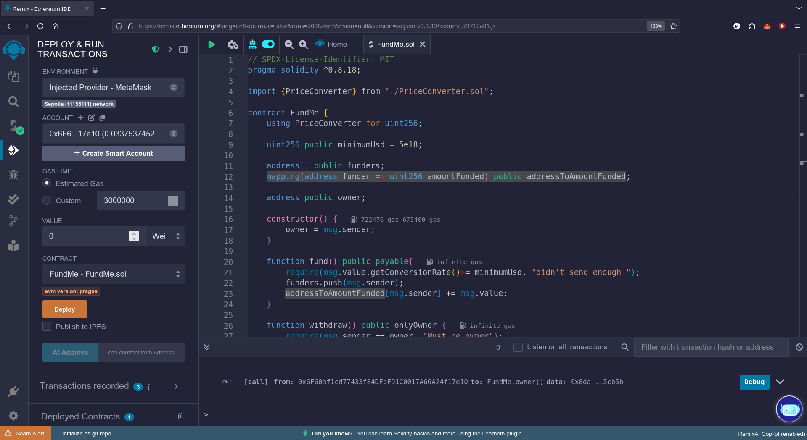

# Fund Me

## Introduction
- In this section, we'll create a _decentralized crowdfunding_ contract

- For this project, we will be using two contracts: `FundMe`, the main crowdfunding contract, and `PriceConverter`. They function much like _Kickstarter_, allowing users to **send** any native blockchain cryptocurrency. They also enable the owner of the contract to **withdraw** all the funds collected. We will then deploy these contracts on a **testnet**.

> 🗒️ **NOTE**\
> Use testnet sparingly. Limiting testnet transactions helps prevent network congestion, ensuring a smoother testing experience for everyone.

## fund and withdraw
- Once `FundMe` is deployed on Remix, you'll notice a set of _functions_, including a new red button labelled `fund`, indicating that the function is _payable_. A payable function allows you to send native blockchain currency (e.g., Ethereum, Polygon, Avalanche) to the contract.

- We'll additionally indicate a **minimum USD amount** to send to the contract when the function `fund` is called. To transfer funds to the `FundMe` contract, you can navigate to the _value section_ of the Remix deployment tab, enter a value (e.g. 0.1 ether) then hit `fund`. A MetaMask transaction confirmation will appear, and the contract balance will remain zero until the transaction is finalized. Once completed, the contract balance will be updated to reflect the transferred amount.

- The contract owner can then `withdraw` the funds. In this case, since we own the contract, the balance will be removed from the contract's balance and transferred to our wallet.

## Conclusion
- These 25 lessons will guide you step-by-step through the implementation of a crowdfunding contract, that supports cryptocurrency contributions and owner withdrawals.

# Project Setup
- Let's begin by coding `FundMe`, a crowdfunding contract allowing users to send funds, which the owner can later withdraw. Before we start, let's clean up our Remix IDE workspace

> 👀❗**IMPORTANT**\
> Before you start coding, try to write down in plain English what you want your code to achieve. This helps clarify your goals and structure your approach.

We want `FundMe` to perform the following tasks:

1. **Allow users to send funds into the contract:** users should be able to deposit funds into the 'FundMe' contract
2. **Enable withdrawal of funds by the contract owner:** the account that owns `FundMe` should have the ability to withdraw all deposited funds
3. **Set a minimum funding value in USD:** there should be a minimum amount that can be deposited into the contract

## fund and withdraw functions
- The FundMe contract will have two primary functions that serve as the main interaction points:

1. **`fund`:** allows users to deposit funds into the contract
2. **`withdraw`:** grants the contract owner the ability to withdraw the funds that have been previously deposited

First, let's code the `fund` function and leave the `withdraw` function commented out for the moment.

```solidity
contract FundMe {
    // send funds into our contract
    function fund() public {}
    // owner can withdraw funds
    /*function withdraw() public {}*/
}
```

***

# Sending Eth through a function
- In this part, we'll explore how to transfer Ethereum (ETH) to a smart contract by creating a `fund` function. This function will require a _minimum amount of ETH_ to ensure proper transaction handling.

## Value and Payable
- When a transaction it's sent to the blockchain, a **value** field is always included in the _transaction data_. This field indicates the **amount** of the native cryptocurrency being transferred in that particular transaction.
For the function `fund` to be able to receive Ethereum, it must be declared **`payable`**. In the Remix UI, this keyword will turn the function red, signifying that it can accept cryptocurrency.

- _Wallet addresses_ and _smart contracts_ are capable of **holding** and **managing** cryptocurrency funds. These entities can interact with the funds, perform transactions, and maintain balance records, just like a wallet.

```solidity
function fund() public payable {
    // allow users to send $
    // have a minimum of $ sent
    // How do we send ETH to this contract?
    msg.value;

    //function withdraw() public {}
}
```

- In Solidity, the **value** of a transaction is accessible through the [`msg.value`](https://docs.soliditylang.org/en/develop/units-and-global-variables.html#special-variables-and-functions) **property**. This property is part of the _global object_ `msg`. It represents the amount of **Wei** transferred in the current transaction, where _Wei_ is the smallest unit of Ether (ETH).

## Reverting transactions
- We can use the`require` keyword as a checker, to enforce our function to receive a minimum `value` of one (1) whole ether:

```solidity
require(msg.value > 1e18); // 1e18 = 1 ETH = 1 * 10 ** 18
```

- This `require` condition ensures that the transaction meets the minimum ether requirements, allowing the function to execute only if this threshold is satisfied. If the specified requirement is not met, the transaction will **revert**

- The require statement in Solidity can include a custom error message, which is displayed if the condition isn't met, clearly explaining the cause of the transaction failure:

```js
require(msg.value > 1 ether, "Didn't send enough ETH"); //if the condition is false, revert with the error message
```

- An online tool like [Ethconverter](https://eth-converter.com/) can be useful for executing conversions between _Ether_, _Wei_, and _Gwei_

> 👀❗**IMPORTANT**\
> 1 Ether = 1e9 Gwei = 1e18 Wei

> 🗒️ **NOTE**\
> Gas costs are usually expressed in Gwei

- If a user attempts to send less Ether than the required amount, the transaction will **fail** and a _message_ will be displayed. For example, if a user attempts to send 1000 Wei, which is significantly less than one Ether, the function will revert and does not proceed.

## Conclusion

- In this lesson, we explored how to use the `value` field of a transaction to transfer Ether to a contract. We also learned how to generate an **error message** when the user sends insufficient Ether to the `FundMe` contract

# Solidity reverts

We will delve into how do _transaction reverts_ work, what is _gas_ where is used.

## Revert

Let's start by adding some logic to the `fund` function:

```solidity
 uint256 public myValue = 1;
 function fund() public {
    myValue = myValue + 2;
 }
```

A _revert_ action **undoes** all prior operations and returns the remaining gas to the transaction's sender. In this `fund` function, `myValue` increases by two (2) units with each successful execution. However, if a revert statement is encountered right after, all actions performed from the start of the function are undone. `myValue` will then reset to its initial state value, or one.

```solidity
 uint256 public myValue = 1;
 function fund() public {
    myValue = myValue + 2;
    require(msg.value > 1e18, "didn't send enough ETH");
    // a function revert will undo any actions that have been done.
    // It will send the remaining gas back
 }
```

## Gas Usage

> 🔥 **CAUTION**\
> The gas used in the transaction will not be refunded if the transaction fails due to a revert statement. The gas has already been **consumed** because the code was executed by the computers, even though the transaction was ultimately reverted.

Users can specify how much gas they're willing to allocate for a transaction. In the case where the `fund` function will contain a lot of lines of code after the `require` and we did indeed set a limit, the gas which was previously allocated but not used will not be charged to the user

> 🗒️ **NOTE**\
> If a transaction reverts, is defined as failed


## Transaction Fields

During a **value** transfer, a transaction will contain the following fields:

* **Nonce**: transaction counter for the account

* **Gas price (wei)**: maximum price that the sender is willing to pay _per unit of gas_

* **Gas Limit**: maximum amount of gas the sender is willing to use for the transaction. A common value could be around 21000.

* **To**: _recipient's address_

* **Value (Wei)**: amount of cryptocurrency to be transferred to the recipient

* **Data**: 🫙 _empty_

* **v,r,s**: components of the transaction signature. They prove that the transaction is authorised by the sender.

During a _**contract interaction transaction**_, it will instead be populated with:

* **Nonce**: transaction counter for the account

* **Gas price (wei)**: maximum price that the sender is willing to pay _per unit of gas_

* **Gas Limit**: maximum amount of gas the sender is willing to use for the transaction. A common value could be around 21000.

* **To**: _address the transaction is sent to (e.g. smart contract)_

* **Value (Wei)**: amount of cryptocurrency to be transferred to the recipient

* **Data**: 📦 _the content to send to the_ _**To**_ _address_, e.g. a function and its parameters.

* **v,r,s**: components of the transaction signature. They prove that the transaction is authorised by the sender.

## Conclusion

**Reverts** and **gas usage** help maintain the integrity of the blockchain state. _Reverts_ will undo transactions when failures occur, while _gas_ enables transactions execution and runs the EVM. When a transaction fails, the gas consumed is not recoverable. To manage this, Ethereum allows users to set the maximum amount of gas they're willing to pay for each transaction.

### 🧑‍💻 Test yourself

**🧑‍💻 Bob sets his gas price to 20 Gwei and his gas limit to 50,000 units. The transaction consumes 30,000 units of gas before a revert occurs. How much ETH will be effectively charged?**

<details>
  <summary>Click to reveal answer</summary>
  <p>
- Gas Price: 20 Gwei
- Gas Consumed (before revert): 30,000 units

Effective Charge = Gas Consumed (before revert) × Gas Price

Effective Charge = 30,000 units × 20 Gwei

1 ETH = 1,000,000,000 Gwei (10^9 Gwei)
So, 1 Gwei = 0.000000001 ETH (10^-9 ETH)

Effective Charge = 30,000 × 20 × 10^-9 ETH
Effective Charge = 0.0006 ETH

**Therefore, Bob will be effectively charged 0.0006 ETH.**

> The gas limit of 50,000 units is the maximum Bob was willing to spend, but since the transaction only consumed 30,000 units before reverting, he is only charged for the gas actually used.

</p>
</details>

***

# Intro to oracles - getting real world price data

With the rapid advancement of blockchain technology and the growing adoption of decentralized finance platforms (DeFi), the necessity to support **multiple digital currencies** has significantly increased. Enabling users to utilize their preferred digital currencies extends market reach and improves the usability of an application.

This lesson will walk you through adding a **currency conversion feature** to the `fundMe` contract and setting **price thresholds** with Chainlink Oracle, a decentralized network for external data.

## USD Values

Currently, our contract will require the transaction value to be greater than _one Ethereum (ETH)_. If we want to give the users the flexibility to spend  5 USD instead, we would need to update our contract. We can begin by specifying the new value with a state variable `uint256 public minimumUSD = 5` at the top of the contract.

```solidity
contract FundMe{

    uint256 public myValue = 1;
   
    function fund() public payable  {
        //Allow users to send $
        // Have a minimum $ sent
        myValue = myValue + 2;
		
        require(msg.value > 1e18, "Didn't send enough eth");
    }
}
```

The next step would be changing the condition inside the `fund` function, to check if the `value` sent is equal to or greater than our `minimumUSD`. However, we are facing a roadblock here: the `minimumUSD` value is in USD while the transaction message value is specified in ETH.

```solidity
contract FundMe{
    
    uint256 public minimumUsd = 5;

    function fund() public payable  {
        //Allow users to send $
        // Have a minimum $ sent
        require(msg.value >= minimumUsd, "Didn't send enough eth");
    }
}
```

## Decentralized Oracles

The USD price of assets like Ethereum cannot be derived from blockchain technology alone but it is determined by the financial markets. To obtain a correct _price information_, a connection between off-chain and on-chain data is necessary. This is facilitated by a _decentralized Oracle network_.

This blockchain limitation exists because of its **deterministic nature**, ensuring that all nodes univocally reach a consensus. Attempting to introduce external data into the blockchain, will disrupt this consensus, resulting in what is referred to as a _smart contract connectivity issue_ or _the Oracle problem_.

For smart contracts to effectively replace traditional agreements, they must have the capability to interact with **real-world data**.

Relying on a centralized Oracle for data transmission is inadequate as it reintroduces potential failure points. Centralizing data sources can undermine the trust assumptions essential for the blockchain functionality. Therefore, centralized nodes are not enough for external data or computation needs. _Chainlink_ addresses these centralization challenges by offering a decentralized Oracle Network.

## How Chainlink Works

Chainlink is a _modular and decentralized Oracle Network_ that enables the integration of data and external computation into a smart contract. When a smart contract combines on-chain and off-chain data, can be defined as **hybrid** and it can create highly feature-rich applications.

Chainlink offers ready-made features that can be added to a smart contract. And we'll address some of them:

* **Data Feeds**

* **Verifiable Random Number**

* **Automation (previously known as "Keepers")**

* **Functions**

## Chainlink Data Feeds

_Chainlink Data Feeds_ are responsible for powering over \$50 billion in the DeFi world. This network of Chainlink nodes aggregates data from various **exchanges** and **data providers**, with each node independently verifying the asset price.


They aggregate this data and deliver it to a reference contract, the **price feed contract**, in a single transaction. Each contract will store the pricing details of a specific cryptocurrency


## Chainlink VRF

The Chainlink VRF (Verifiable Random Function) provides a solution for generating **provably random numbers**, ensuring true fairness in applications such as NFT randomization, lotteries, and gaming. These numbers are determined off-chain, and they are immune to manipulation.


## Chainlink Automation (previously known as "Keepers")

Another great feature is Chainlink's system of _Keepers_. These **nodes** listen for specific events and, upon being triggered, automatically execute the intended actions within the calling contract.

## Chainlink Function

Finally, _Chainlink Functions_ allow **API calls** to be made within a decentralized environment. This feature is ideal for creating innovative applications and is recommended for advanced users with a thorough understanding of Chainlink ecosystem.

## Conclusion

_Chainlink Data Feeds_ will help integrate currency conversion inside of our `FundMe` contract. Chainlink's decentralized Oracle network not only addresses the 'Oracle problem', but provides a suite of additional features for enhancing every dApp capabilities.


***

# Quiz: Fund Me Intro
**1. What is the correct relationship between Wei, Gwei, and Ether in Ethereum's unit system?**
* *a) 1 Ether = 1,000 Gwei = 1,000,000 Wei*
* *b) 1 Ether = 1,000,000,000 Gwei = 1,000,000,000,000,000,000 Wei*
* *c) 1 Gwei = 1,000 Wei = 1,000,000 Ether*
* *d) 1 Ether = 1,000 Wei = 1,000,000 Gwei*

<details>
  <summary>Click to reveal answer</summary>
  <p>b) 1 Ether = 1,000,000,000 Gwei = 1,000,000,000,000,000,000 Wei</p>
</details>

**2. What is the purpose of the revert action?**
* *a) A revert action allows you to undo the most recent state change on the smart contract when called.*
* *b) A revert action allows you to un-deploy a smart contract.*
* *c) A revert action undoes all prior operations and returns the remaining gas to the transaction's sender.*
* *d) A revert action stops execution but keeps all state changes up until that point.*

<details>
  <summary>Click to reveal answer</summary>
  <p>c) A revert action undoes all prior operations and returns the remaining gas to the transaction's sender.</p>
</details>

**3. Which keyword is used to allow a function to receive native blockchain tokens such as ETH?**
* *a) payable*
* *b) transfer*
* *c) token*
* *d) receive*

<details>
  <summary>Click to reveal answer</summary>
  <p>a) payable.</p>
</details>

***

# Mid Section Recap
We've explored the usage of the keyword `payable`, the global property `msg.value` and what happens when a function reverts.

## Payable, required, msg.value
To enable a function to receive a native blockchain token such as Ethereum, it must be marked as `payable`:

```solidity
function deposit() public payable {
    balances[msg.sender] += msg.value;
}
```
If we want a function to fail under certain conditions, we can use the `require` statement. For example, in a bank transfer scenario, we want the operation to fail if the sender does not have enough balance. Here's an example:

```solidity
function transfer(address recipient, uint amount) public {
    require(balances[msg.sender] >= amount);
    balances[msg.sender] -= amount;
    balances[recipient] += amount;
}
```

In this code, if the condition `balances[msg.sender] >= amount` is not met, the transaction will revert. This means the operation undoes any previous actions and will not consume the total maximum gas allocated by the user.

The Solidity global property msg.value contains the amount of cryptocurrency sent with a transaction.

## Integrating External Data with Chainlink

Chainlink is a revolutionary technology that enables the integration of external data and computation into smart contracts. It provides a decentralized way of **injecting data**, which is particularly useful for assets whose values fluctuate over time. For instance, if a smart contract deals with real-world assets such as stocks or commodities, obtaining real-time pricing information is crucial.

> 🗒️ **NOTE**\
> Chainlink enables smart contracts to interact with real-world data and services without sacrificing the security and reliability guarantees inherent to blockchain technology.

Consider a smart contract that deals with a commodity like gold. _Chainlink Price Feeds_ can provide real-time gold prices, allowing the smart contract to reflect the current market prices.

```solidity
import "@chainlink/contracts/src/v0.6/interfaces/AggregatorV3Interface.sol";
contract GoldPriceContract {
    AggregatorV3Interface internal priceFeed;
    // The Chainlink price feed contract address
    constructor() public {
        priceFeed = AggregatorV3Interface(0x8468b2bDCE073A157E560AA4D9CcF6dB1DB98507);
    }
    // Get the latest gold price
    function getLatestGoldPrice() public view returns (int) {
        (,int price,,,) = priceFeed.latestRoundData();
        return price;
    }
}
```

In this example, _Chainlink Feeds_ are used to query the latest price of gold, ensuring the smart contract has up-to-date market information.

## Conclusion
Understanding and utilizing payable, require, and msg.value is crucial for handling transactions in Solidity. Besides that, Chainlink enhances smart contract functionality by providing access to real-world data, allowing for more dynamic and reliable decentralized applications.

***

# Solidity Interfaces

In This part we'll learn how to convert Ethereum (ETH) into Dollars (USD) and how to use interfaces.

## Converting Ethereum into USD

We begin by trying to convert the `msg.value`, which is now specified in ETH, into USD. This process requires fetching the **current USD market price** of Ethereum and using it to convert the `msg.value` amount into USD.

```solidity
 // Function to get the price of Ethereum in USD
 function getPrice() public {}
 // Function to convert a value based on the price
 function getConversionRate() public {}
```

## Chainlink Data Feed
Our primary source for Ethereum prices is a **Chainlink Data Feed**. [Chainlink Data Feed documentation](https://docs.chain.link/data-feeds/using-data-feeds) provides an example of how to interact with a Data Feed contract:

1. `AggregatorV3Interface`: a contract that takes a _Data Feed address_ as input. This contract maintains the ETH/USD price updated.
2. `latestRoundData`: a function that returns an `answer`, representing the latest Ethereum price.

To utilize the **Price Feed Contract**, we need its address and its ABI. The address is available in the Chainlink documentation under the [Price Feed Contract Addresses](https://docs.chain.link/data-feeds/price-feeds/addresses). For our purposes, we'll use ETH/USD price feed.

## Interface
To obtain the ABI, you can import, compile, and deploy the PriceFeed contract itself. In the previous section, we imported the `SimpleStorage` contract into the `StorageFactory` contract, deployed it, and only then we were able to use its functions.

An alternative method involves the use of an **Interface**, which defines methods signature without their implementation logic. If compiled, the Price Feed Interface, it would return the ABI of the Price Feed contract itself, which was previously deployed on the blockchain. We don't need to know anything about the function implementations, only knowing the `AggregatorV3Interface` methods will suffice. The Price Feed interface, called `Aggregator V3 Interface`, can be found in [Chainlink's GitHub repository](https://github.com/smartcontractkit/chainlink/blob/develop/contracts/src/v0.8/shared/interfaces/AggregatorV3Interface.sol).

> 🗒️ **NOTE**\
> Interfaces allow different contracts to interact seamlessly by ensuring they share a common set of functionalities.

We can test the Interface usage by calling the `version()` function:

```solidity
function getVersion() public view returns (uint256) {
    return AggregatorV3Interface(0x5f4eC3Df9cbd43714FE2740f5E3616155c5b8419).version();
}
```

> 🗒️ **NOTE**\
> It's best to work on testnets only after your deployment is complete, as it can be time and resource consuming.

## Conclusion
Using interfaces is a common and effective way to interact with external contracts. First, obtain the interface of the external contract, compile it to get the ABI, and then use the deployed contract's address. This allows you to call any function available at that address seamlessly.

### 🧑‍💻 Test yourself
1. 📕 Explain the role of interfaces in Solidity and why are they advantageous.

<details>
  <summary>Click to reveal answer</summary>
  <p>
Role of Interfaces:
Interfaces in Solidity are abstract contracts that define function signatures without implementation. They serve as templates that specify what functions must be implemented by any contract that inherits or interacts with them.

Advantages:
- Standardization: They create standard ways for contracts to interact (like ERC20, ERC721 standards)
- Decoupling: Allow contracts to interact without needing to know each other's full implementation
- Security: Reduce risk by limiting interaction to only defined functions
- Interoperability: Enable different contracts to work together seamlessly
- Upgradeability: Facilitate proxy patterns and upgradeable contracts
- Code Reusability: Multiple contracts can implement the same interface
- Reduced Deployment Costs: Interfaces are lightweight compared to full contracts
</p>
</details>

2. 📕 What are the steps required to convert a variable containing a value in ETH to its equivalent in USD?

<details>
  <summary>Click to reveal answer</summary>
 
```solidity
// 1. Get the latest price data
(, int256 price, , , ) = priceFeed.latestRoundData();

// 2. Get the ETH amount (msg.value is in wei)
uint256 ethAmountInWei = msg.value;

// 3. Convert wei to ether (divide by 1e18)
uint256 ethAmount = ethAmountInWei / 1e18;

// 4. Convert ETH to USD (adjust for decimals)
uint256 usdAmount = (ethAmount * uint256(price)) / (10 ** priceFeed.decimals());
```

</details>

3. 🧑‍💻 Implement another function on the `FundMe` contract that implements the `decimals()` methods of the Data Feed address.

<details>
  <summary>Click to reveal answer</summary>
  
```solidity
// SPDX-License-Identifier: MIT
pragma solidity ^0.8.0;

import "@chainlink/contracts/src/v0.8/interfaces/AggregatorV3Interface.sol";

contract FundMe {
    AggregatorV3Interface internal priceFeed;
    
    constructor(address _priceFeed) {
        priceFeed = AggregatorV3Interface(_priceFeed);
    }
    
    // Function to get decimals from the price feed
    function getPriceFeedDecimals() public view returns (uint8) {
        return priceFeed.decimals();
    }
    
    // Rest of FundMe contract...
}
```
<p>
This implementation:
- Imports the Chainlink AggregatorV3Interface,
- Stores the price feed address in the constructor,
- Creates a view function that calls the decimals() method on the price feed,
- Returns the decimals value (typically 8 for most Chainlink price feeds)
</p>
</details>

***

# Importing libaries from NPM and Github

## Direct Imports from GitHub

- Smart Contracts _hosted on GitHub_ can be imported directly into your project. For instance, consider the `AggregatorV3Interface` contract from Chainlink, which is located in Chainlink's GitHub repository and not in our project's directory.

- Instead of manually copying all its code into your project and then importing it like this:

```Solidity
import { AggregatorV3Interface } from "./AggregatorV3Interface.sol":
```

- We can import it more efficiently, as specified in the [Chainlink documentation](https://docs.chain.link/docs/using-chainlink-reference-contracts):

```solidity
import { AggregatorV3Interface } from "@chainlink/contracts/src/v0.8/interfaces/AggregatorV3Interface.sol";
```

This import statement includes the **path** to the AggregatorV3Interface.sol file in the GitHub repository, allowing you to directly import the contract from GitHub or NPM (Node Package Manager).

## Importing from NPM

- The `@chainlink/contracts` package, available on NPM, follows **Semantic Versioning (SemVer)**, which allows you to download and use specific versions in your contracts (e.g., `npm install @chainlink/contracts@1.2.3`) while being directly _synchronized_ with Chainlink's GitHub repository. The rest of the import path specifies the exact file that Remix should use.

- Remix interprets `@chainlink/contracts` as a reference to the [NPM package](https://www.npmjs.com/package/@chainlink/contracts), and downloads all the necessary code from it.

```solidity
 pragma solidity ^0.8.18;
 import {AggregatorV3Interface} from "@chainlink/contracts/src/v0.8/interfaces/AggregatorV3Interface.sol";
 contract FundMe {}
```

## Conclusion
Efficiently managing external smart contracts is crucial in smart contract development to maintain _clean and readable_ source code. Utilizing **direct imports** from GitHub and NPM, as shown with Chainlink's AggregatorV3Interface, simplifies this process.


# Getting real world price data from Chainlink
The `AggregatorV3Interface` provides a streamlined ABI for interacting with the Data Feed contract. In this lesson, we'll explore how to retrieve pricing information from it.

## Creating a New Contract Instance

The `AggregatorV3Interface` includes the `latestRoundData` function, which retrieves the latest cryptocurrency price from the specified contract. We'll start by declaring a new variable, `priceFeed`, of type `AggregatorV3Interface`. This interface requires the address of the Data Feed contract deployed on the Sepolia Network.

```solidity
AggregatorV3Interface priceFeed = AggregatorV3Interface(0x1b44F3514812d835EB1BDB0acB33d3fA3351Ee43);
```
## The `latestRoundData` Function
We can call the `latestRoundData()` function on this interface to obtain several values, including the latest price.

```solidity
function latestRoundData() external view returns (uint80 roundId, int256 answer, uint256 startedAt, uint256 updatedAt, uint80 answeredInRound);
```

For now, we'll focus on the `answer` value and ignore the other returned values by using commas as placeholders for the unneeded variables.

```solidity
function getLatestPrice() public view returns (int) {
    (,int price,,,) = priceFeed.latestRoundData();
    return price;
}
```

Our `getLatestPrice()` function now retrieves the latest ETH price in USD from the `latestRoundData()` function of the Data Feed contract. The returned price is an `int256` with a precision of 1e8, as indicated by the `decimals` function.

## Decimals

* `msg.value` is a `uint256` value with 18 decimal places.

* `answer` is an `int256` value with 8 decimal places (USD-based pairs use 8 decimal places, while ETH-based pairs use 18 decimal places).

This means the `price` returned from our `latestRoundData` function isn't directly compatible with `msg.value`. To match the decimal places, we multiply `price` by 1e10:

```solidity
return price * 1e10;
```

## Typecasting

Typecasting, or type conversion, involves converting a value from one data type to another. In Solidity, not all data types can be converted due to differences in their underlying representations and the potential for data loss. However, certain conversions, such as from `int` to `uint`, are allowed.

```solidity
return uint(price) * 1e10;
```

We can finalize our `view` function as follows:

```solidity
function getLatestPrice() public view returns (uint256) {
    (,int answer,,,) = priceFeed.latestRoundData();
    return uint(answer) * 1e10;
}
```

## Conclusion
This complete `getLatestPrice` function retrieves the latest price, adjusts the decimal places, and converts the value to an unsigned integer, making it compatible for its use inside other functions.


## 🧑‍💻 Test yourself

1. 📕 Why we need to multiply the latest ETH price by 1e10?
<details>
  <summary>Click to reveal answer</summary>
  <p>
Chainlink price feeds return values with a specific number of decimals. For example:

The ETH/USD price feed usually returns 8 decimals (i.e., 1 ETH = 3500_00000000)
But uint256 values in Solidity often assume 18 decimals, especially when working with ETH in wei.
So to scale the value up to 18 decimals, you multiply by 1e10:

// Chainlink returns 8 decimals, we want 18
uint256 adjustedPrice = priceFromChainlink * 1e10;

This ensures unit consistency when doing math with other 18-decimal values like ETH balances or token prices.
</P>
</details>

2. 📕 What's the result of the typecasting `uint256(-2)`?
<details>
  <summary>Click to reveal answer</summary>
  <p>
In Solidity:
-2 is a negative number (int256), but you are converting it to unsigned (uint256), which wraps around using two’s complement.
So:
uint256(-2) == 2^256 - 2

This equals:
115792089237316195423570985008687907853269984665640564039457584007913129639934

➡️ It’s a very large number just 2 less than the maximum uint256.
</p>
</details>

3. 🧑‍💻 Create a contract with a `getLatestBTCPriceInETH()` function that retrieves the latest BTC price in ETH.
<details>
  <summary>Click to reveal answer</summary>

```solidity  
// SPDX-License-Identifier: MIT

pragma solidity ^0.8.18;

import "@chainlink/contracts/src/v0.8/interfaces/AggregatorV3Interface.sol";

contract PriceFeedBTCtoETH {
    AggregatorV3Interface internal btcEthPriceFeed;

    constructor(address _btcEthPriceFeed) {
        btcEthPriceFeed = AggregatorV3Interface(_btcEthPriceFeed);
    }

    function getLatestBTCPriceInETH() public view returns (uint256) {
        (, int256 price, , , ) = btcEthPriceFeed.latestRoundData();
        // Chainlink usually returns 18 decimals for BTC/ETH
        return uint256(price);
    }
}
```
</details>

# Solidity Math
In this lesson, we will guide you through converting the value of ETH to USD. We'll use the previously defined `getPrice` function within the new `getConversionRate` function.

## The `getPrice` and `getConversionRate` Functions

The `getPrice` function returns the current value of Ethereum in USD as a `uint256`.\
The `getConversionRate` function converts a specified amount of ETH to its USD equivalent.

## Decimal Places

In Solidity, only integer values are used, as the language does not support floating-point numbers.

```solidity
function getConversionRate(uint256 ethAmount) internal view returns (uint256) {
    uint256 ethPrice = getPrice();
    uint256 ethAmountInUsd = (ethPrice * ethAmount) / 1e18;
    return ethAmountInUsd;
}
```

> 🗒️ **NOTE**\
> The line `uint256 ethAmountInUsd = (ethPrice * ethAmount)` results in a value with a precision of 1e18 * 1e18 = 1e36. To bring the precision of `ethAmountInUsd` back to 1e18, we need to divide the result by 1e18.

> 🔥 **CAUTION**\
> Always multiply before dividing to maintain precision and avoid truncation errors. For instance, in floating-point arithmetic, `(5/3) * 2` equals approximately 3.33. In Solidity, `(5/3)` equals 1, which when multiplied by 2 yields 2. If you multiply first `(5*2)` and then divide by 3, you achieve better precision.

## Example of `getConversionRate`

* `ethAmount` is set at 1 ETH, with 1e18 precision.

* `ethPrice` is set at 2000 USD, with 1e18 precision, resulting in 2000e18.

* `ethPrice * ethAmount` results in 2000e36.

* To scale down `ethAmountInUsd` to 1e18 precision, divide `ethPrice * ethAmount` by 1e18.

## Checking Minimum USD Value

We can verify if users send at least 5 USD to our contract:

```solidity
require(getConversionRate(msg.value) >= MINIMUM_USD, "You need to spend more ETH!");
```

Since `getConversionRate` returns a value with 18 decimal places, we need to multiply `5` by `1e18`, resulting in `5 * 1e18` (equivalent to `5 * 10**18`).

### Deployment to the Testnet

In Remix, we can deploy the `FundMe` contract to a testnet. After deployment, the `getPrice` function can be called to obtain the current value of Ethereum. It's also possible to send money to this contract, and an error will be triggered if the ETH amount is less than 5 USD.

```markdown
Gas estimation failed. Error execution reverted, didn't send enough ETH.
```

## Conclusion

In this lesson, we've demonstrated how to convert ETH to USD using the `getConversionRate` function, ensuring precise calculations by handling decimal places correctly.


# Msd sender explained

In this lesson, we will learn how to track addresses that are funding the contract and the amounts they will send to it.

## Tracking Funders

To track the addresses are sending money to the contract, we can create an array of addresses named `funders`:

```js
address[] public funders;
```

Whenever someone sends money to the contract, we will add their address to the array with the `push` function:

```js
funders.push(msg.sender);
```

The `msg.sender` global variable refers to the address that **initiates the transaction**.

## Mapping Users to Funds Sent

We can also map each funder's address to the amount they have sent using **mappings**. Let's define a mapping in Solidity:

```js
mapping(address => uint256) public addressToAmountFunded;
```

The `addressToAmountFunded` mapping associates each funder's address with the total amount they have contributed. When a new amount is sent, we can add it to the user's total contribution:

```js
addressToAmountFunded[msg.sender] += msg.value;
```

## Conclusion

We have successfully implemented a system to track users who fund the `fundMe` contract. This mechanism records every address that is sending ETH to the contract, and maps the sender's address to the total amount they have contributed.

##🧑‍💻 Test yourself

1. 🧑‍💻 Implement a function `contributionCount` to monitor how many times a user calls the `fund` function to send money to the contract.
<details>
<summary>Click to reveal answer</summary>

```solidity
// SPDX-License-Identifier: MIT
pragma solidity ^0.8.18;

contract FundTracker {
    mapping(address => uint256) public addressToContributionCount;

    // Users call this to fund the contract
    function fund() public payable {
        require(msg.value > 0, "Must send ETH to fund");
        addressToContributionCount[msg.sender] += 1;
    }

    // Returns the number of times a user has funded
    function contributionCount(address user) public view returns (uint256) {
        return addressToContributionCount[user];
    }
}
```
</details>


# Quick Section Recap
In this recap, we'll review how to interact with an external contract and utilize its functions, understand Chainlink Price Feeds, perform Solidity math, and explore global properties.

## Interacting with an External Contract

To interact with any external contract, you need the contract's _address_ and _ABI_ (Application Binary Interface). Think of the `address` as a _house number_ that identifies the specific contract on the blockchain, while the `ABI` serves as a _manual_ that explains how to interact with the contract.

To obtain the contract ABI, you can compile a Solidity **interface** that the target contract implements. Then, create a new instance of the interface pointing to the specific address of the deployed contract.

## Chainlink Price Feeds

[Chainlink Price Feeds](https://docs.chain.link/docs/using-chainlink-reference-contracts/) provide a reliable way to access real-world data, such as pricing data, and inject it into smart contracts. This is particularly useful for executing mathematical operations in Solidity and the Ethereum Virtual Machine (EVM), where floating-point numbers are not used.

## Solidity Global Properties

The [Solidity documentation](https://docs.soliditylang.org/en/latest/cheatsheet.html#block-and-transaction-properties) provides several global properties that are essential for interacting with the Ethereum blockchain. Here are two key properties:

* `msg.sender`: this property refers to the address of the account that **initiated the current function call**

* `msg.value`: this property represents the **amount of Wei** sent with a function call

```solidity
function updateValue() public payable {
    require(msg.value >= 1 ether, "Not enough Ether provided.");
}
```

By understanding these concepts, you can effectively interact with external contracts, leverage Chainlink Price Feeds for real-world data, and utilize Solidity's global properties for more robust smart contract development.

# Creating your own libraies
In the previous lesson, we used the `getPrice()` function and `getConversionRate`. These methods can be reused multiple times for anyone working with Price Feeds. When a functionality can be _commonly used_, we can create a **library** to efficiently manage repeated parts of codes.

## Libraries
Great examples of Libraries can be found in the [Solidity by example](https://solidity-by-example.org/library/) website.
Solidity libraries are similar to contracts but do not allow the declaration of any **state variables** and **cannot receive ETH**.

> 👀❗**IMPORTANT**\
> All functions in a library must be declared as `internal` and are embedded in the contract during compilation. If any function is not marked as such, the library cannot be embedded directly, but it must be deployed independently and then linked to the main contract.

We can start by creating a new file called `PriceConverter.sol`, and replace the `contract` keyword with `library`.

```solidity
// SPDX-License-Identifier: MIT
pragma solidity ^0.8.18;
library PriceConverter {}
```

Let's copy `getPrice`, `getConversionRate`, and `getVersion` functions from the `FundMe.sol` contract into our new library, remembering to import the `AggregatorV3Interface` into `PriceConverter.sol`. Finally, we can mark all the functions as `internal`.

```solidity
// SPDX-License-Identifier: MIT
pragma solidity ^0.8.18;

import {AggregatorV3Interface} from "@chainlink/contracts/src/v0.8/shared/interfaces/AggregatorV3Interface.sol";

library PriceConverter {
     function getPrice() internal view returns(uint256){
        //Address 0x694AA1769357215DE4FAC081bf1f309aDC325306
        //ABI
        AggregatorV3Interface priceFeed = AggregatorV3Interface(0x694AA1769357215DE4FAC081bf1f309aDC325306);
        (,int256 price,,,) = priceFeed.latestRoundData();
        return uint256(price * 1e10);
    }

    function getConversionRate(uint256 ethAmount) internal view returns (uint256) {
        uint256 ethPrice = getPrice();
        uint256 ethAmountInUsd = (ethPrice * ethAmount) / 1e18;
        return ethAmountInUsd;
    }

    function getVersion() internal view returns (uint256){
        return AggregatorV3Interface(0x694AA1769357215DE4FAC081bf1f309aDC325306).version();
}
}
```

## Accessing the Library
You can import the library in your contract and attach it to the desired type with the keyword `using`:

```solidity
import {PriceConverter} from "./PriceConverter.sol";
using PriceConverter for uint256;
```

The `PriceConverter` functions can then be called as if they are native to the `uint256` type. For example, calling the `getConversionRate()` function will now be changed into:

```solidity
require(msg.value.getConversionRate() >= minimumUsd, "didn't send enough ETH");
```

Here, `msg.value`, which is a `uint256` type, is extended to include the `getConversionRate()` function. The `msg.value` gets passed as the first argument to the function. If additional arguments are needed, they are passed in parentheses:

```solidity
uint256 result = msg.value.getConversionRate(123);
```

In this case, `123` is passed as the second `uint256` argument to the function.

## Conclusion
In this lesson, we explored the benefits of using _libraries_ to reuse code and add new functionalities. We created a `PriceConverter` library to handle `getPrice`, `getConversionRate`, and `getVersion` functions, demonstrating how to structure and utilize libraries effectively.

## 🧑‍💻 Test yourself

1. 🧑‍💻 Create a simple library called `MathLibrary` that contains a function `sum` to add two `uint256` numbers. Then create a function `calculateSum` inside the `fundMe` contract that uses the `MathLibrary` function.

<details>
<summary>Click to reveal answer</summary>

```solidity
// MathLibrary.sol
// SPDX-License-Identifier: MIT
pragma solidity ^0.8.15;

library MathLibrary {
    function sum(uint256 a, uint256 b) internal pure returns (uint256){
        return a + b;
    }
}
```

```solidity
// FundMe.sol
    function calculateSum(uint256 a,uint256 b) public pure returns (uint256) {
        uint256 result2 = a.sum(b);
        return result2;
    }
```
</details>

# Using Safemath
In this lesson, we will explore `SafeMath`, a widely used library before Solidity version 0.8, and understand why its usage has now decreased.

## Integer Overflow

`SafeMath.sol` was a staple in Solidity contracts before version 0.8. After this version, its usage has significantly dropped.

Let's begin by creating a new file called `SafeMathTester.sol` and adding a function `add` that increments the `bigNumber` state variable.

```solidity
// SafeMathTester.sol
pragma solidity ^0.6.0;

contract SafeMathTester {
    uint8 public bigNumber = 255;

    function add() public {
        bigNumber = bigNumber + 1;
    }
}
```

Notice we are using compiler version `0.6.0`. The `bigNumber` is a `uint8` variable with a maximum value of `255`. If we call the `add` function, it will return `0` instead of the expected `256`.

Before Solidity version **0.8.0**, signed and unsigned integers were **unchecked**, meaning that if they exceeded the maximum value the variable type could hold, they would reset to the lower limit. This pattern is known as **integer overflow** and the `SafeMath` library was designed to prevent it.

## SafeMath
`SafeMath.sol` provided a mechanism to revert transactions when the maximum limit of a `uint256` data type was reached. It was a typical security measure across contracts to avoid erroneous calculations and potential exploits.

```solidity
function add(uint a, uint b) public pure returns (uint) {
    uint c = a + b;
    require(c >= a, "SafeMath: addition overflow");
    return c;
}
```

## Solidity 0.8.0

- With the introduction of Solidity version 0.8, automatic checks for overflows and underflows were implemented, making `SafeMath` redundant for these checks. If `SafeMathTester.sol` is deployed with Solidity `0.8.0`, invoking the `add` function will cause a transaction to fail, when, in older versions, it would have reset to zero.

- For scenarios where mathematical operations are known not to exceed a variable's limit, Solidity introduced the `unchecked` construct to make code more _gas-efficient_. Wrapping the addition operation with `unchecked` will _ignore the overflow and underflow checks_: if the `bigNumber` exceeds the limit, it will wrap its value to zero

```solidity
uint8 public bigNumber = 255;

function add() public {
    unchecked {
        bigNumber = bigNumber + 1;
    }
}
```

> 🔥 **CAUTION**\
> It's important to use unchecked blocks with caution as they reintroduce the possibility of overflows and underflows.

## Conclusion

The evolution of Solidity and `SafeMath.sol` highlights the continuous advancements in Ethereum smart contract development. Although recent updates have made `SafeMath.sol` less essential, it remains a significant part of Ethereum's history. Understanding its role provides valuable insight into the progress and maturation of Solidity.

# Solidity For Loop
- We'll set up the withdraw function to enable the retrieval of accumulated funds. We'll then reset all the mappings to zero using a method known as a for loop.

## For Loops
A for loop is a widely-used concept in many programming languages that enables the execution of a block of code a repeated amount of times.

For example, consider this list:

```Solidity
//[1, 2, 3, 4] elements
// 0  1  2  3  indexes
```

The elements of the list are the numbers 1 through 4, with indices ranging from 0 to 3: the number 1 is at index 0, the number 2 is at index 1, and so on. To access all the elements in this list, we can use their **indexes**.

A typical for loop structure in programming languages involves:

1. Initializing at some starting index

2. Iterating until an end index

3. Incrementing by certain steps

For instance, if we start the loop at index 0, end at index 10, and increment by 1 each time, we'll get:

```Solidity
0, 1, 2, 3, 4, 5, 6, 7, 8, 9, 10
```

However, if we start at index 3, end at index 12, and increment by 2 each time, we get:

```Solidity
3, 5, 7, 9, 11
```

## Using for Loops in the FundMe Contract

To implement this concept in the `FundMe` contract:

```solidity
uint256 funderIndex;
/* starting index (initialization), ending index, step amount */
for (funderIndex = 0; funderIndex < funders.length; funderIndex++) {
    address funder = funders[funderIndex];
    addressToAmountFunded[funder] = 0;
}
```

The loop begins at index 0 and goes through all the elements in the `funders` array until it reaches the final element. With each iteration, it performs the following actions:

1. Accesses the `funder` address at the current index
2. Resets the corresponding funding amount in the `addressToAmountFunded` mapping to zero, clearing the `funder`'s record.

> 🗒️ **NOTE**/
> The **addressToAmountFunded** map connects addresses with the respective amounts they funded.

## Shortcuts
Additionally, we have used two shorthands in our code:

1. `funderIndex++`: shorthand for `funderIndex = funderIndex + 1`.
2. `+=`: adds a value to an existing one. `x = x + y` is equivalent to `x += y`.

To illustrate the code snippet, we start from `funderIndex` 0. When entering the loop, we get the address of the funder at the 1st position in the `funders` array and set its amount to zero. After that, we repeat the loop, incrementing the `funderIndex` by 1 and checking whether it is still less than the total number of funders. We then get the address of the funder at the next position and so on.

##Conclusion

In this lesson, we learned how to implement the withdraw function to manage accumulated funds and reset mappings using a for loop. This process ensures efficient handling of funders' records.

***

# Quiz: Fund Me Mid Section Recap
**1. Which Solidity keyword specifies that a function can only be called by another contract or wallet, and not within the same contract?**
* *a) Public*
* *b) External*
* *c) Private*
* *d) Internal*

<details>
  <summary>Click to reveal answer</summary>
  <p>b) External</p>
</details>

**2. What is type casting in Solidity?**
* *a) Converting a value from one data type to another.*
* *b) Modifying a variable's internal structure.*
* *c) Checking the type of a variable.*
* *d) Creating a new data type.*

<details>
  <summary>Click to reveal answer</summary>
  <p>a) Converting a value from one data type to another.</p>
</details>

**3. Why is it important to multiply before dividing in Solidity to maintain precision, and how does this affect calculations?**
* *a) Multiplying before dividing is not necessary in Solidity since it automatically adjusts for floating-point precision. Thus, both (5 / 3) * 2 and (5 * 2) / 3 will produce the same result.*
* *b) Dividing before multiplying provides higher precision in Solidity, as the language optimizes division operations to avoid truncation errors.*
* *c) Multiplying before dividing ensures that precision is preserved, as Solidity performs integer division where truncation occurs if division is done first. For example, (5 * 2) / 3 yields 3, whereas (5 / 3) * 2 yields 2.*
* *d) Solidity handles precision errors by converting all operations to floating-point arithmetic, making the order of operations irrelevant for maintaining precision.*

<details>
  <summary>Click to reveal answer</summary>
  <p> c) Multiplying before dividing ensures that precision is preserved, as Solidity performs integer division where truncation occurs if division is done first. For example, (5 * 2) / 3 yields 3, whereas (5 / 3) * 2 yields 2.</p>
</details>

**4. What does the global variable 'msg.sender' represent?**
* *a) The receiver of the current message or transaction.*
* *b) The current block number.*
* *c) The contract address where the transaction originated*
* *d) The sender of the current message or transaction.*

<details>
  <summary>Click to reveal answer</summary>
  <p>b) The sender of the current message or transaction.</p>
</details>

**5. What is the primary purpose of creating a library in Solidity?**
* *a) To store large amounts of data in an efficient manner.*
* *b) To create a separate execution environment for complex logic.*
* *c) To re-use common functionality across multiple contracts.*
* *d) To interact with external systems or APIs.*

<details>
  <summary>Click to reveal answer</summary>
  <p>c) To re-use common functionality across multiple contracts</p>
</details>

**6. What is the significance of the 'unchecked' keyword in Solidity?**
* *a) It allows developers to bypass built-in overflow checks, potentially improving gas efficiency but increasing the risk of errors*
* *b) It specifies that a function should only be executed on a specific type of virtual machine.*
* *c) It enables the use of advanced mathematical operations that are not supported by default.*
* *d) It indicates that a function should be executed without any error handling.*

<details>
  <summary>Click to reveal answer</summary>
  <p>a) It allows developers to bypass built-in overflow checks, potentially improving gas efficiency but increasing the risk of errors</p>
</details>

**7. Which of the following Solidity code snippets would cause an overflow error if executed?**
* *a) uint256 x = 100; x = x - 1;*
* *b) uint8 x = 255; x = x + 1;*
* *c) uint256 x = 100; x = x * 2;*
* *d) uint16 x = 100; x = x / 2;*

<details>
  <summary>Click to reveal answer</summary>
  <p>b) uint8 x = 255; x = x + 1;</p>
</details>

**8. When using a 'for' loop to iterate through an array, how do you access the current element being processed during each iteration?**
* *a) Use the 'value' keyword to access the element.*
* *b) Use the Iterator variable as an index to access the array element.*
* *c) Use the 'current' keyword to access the element.*
* *d) Access the element directly without an index.*

<details>
  <summary>Click to reveal answer</summary>
  <p>b) Use the Iterator variable as an index to access the array element.</p>
</details>

***

# Resetting an array

The simplest way to reset the `funders` array is similar to the method used with the mapping: iterate through all its elements and reset each one to 0. Alternatively, we can create a brand new `funders` array.

```solidity
funders = new address[]();
```

> 🗒️ **NOTE**\
> You might recall using the `new` keyword when deploying a contract. In this context, however, it resets the `funders` array to a zero-sized, blank address array.

## Conclusion

In this lesson, we learned how to reset the `funders` array by either iterating through its elements or creating a new zero-sized array. This step is crucial for completing the `withdraw` function and ensuring the contract's data is properly managed.


# Sending Eth from a Contract

This lesson explores three different methods of sending ETH from one account to another: `transfer`, `send`, and `call`. We will understand their differences, how each one works, and when to use one instead of another.

## Transfer
The `transfer` function is the simplest way to send Ether to a recipient address:

```solidity
payable(msg.sender).transfer(amount); // the current contract sends the Ether amount to the msg.sender
```

It's necessary to convert the recipient address to a **payable** address to allow it to receive Ether. This can be done by wrapping `msg.sender` with the `payable` keyword.

However, `transfer` has a significant limitation. It can only use up to 2300 gas and it reverts any transaction that exceeds this gas limit, as illustrated by [Solidity by Example](https://solidity-by-example.org/sending-ether/).

## Send

The `send` function is similar to `transfer`, but it differs in its behaviour:

```solidity
bool success = payable(msg.sender).send(address(this).balance);
require(success, "Send failed");
```

Like `transfer`, `send` also has a gas limit of 2300. If the gas limit is reached, it will not revert the transaction but return a boolean value (`true` or `false`) to indicate the success or failure of the transaction. It is the developer's responsibility to handle failure correctly, and it's good practice to trigger a **revert** condition if the `send` returns `false`.

## Call

The `call` function is flexible and powerful. It can be used to call any function **without requiring its ABI**. It does not have a gas limit, and like `send`, it returns a boolean value instead of reverting like `transfer`.

```solidity
(bool success, ) = payable(msg.sender).call{value: address(this).balance}("");
require(success, "Call failed");
```

To send funds using the `call` function, we convert the address of the receiver to `payable` and add the value inside curly brackets before the parameters passed.

The `call` function returns two variables: a boolean for success or failure, and a byte object which stores returned data if any.

> 👀❗**IMPORTANT**\
> `call` is the recommended way of sending and receiving Ethereum or other blockchain native tokens.

## Conclusion

In conclusion, _transfer_, _send_, and _call_ are three unique methods for transferring Ether in Solidity. They vary in their syntax, behaviour, and gas limits, each offering distinct advantages and drawbacks.

# Constructor

Currently, **anyone** can call the `withdraw` function and drain all the funds from the contract. To fix this, we need to **restrict** the withdrawal function to the contract owner.

One solution could be to create a function, `callMeRightAway`, to assign the role of contract owner to the contract's creator immediately after deployment. However, this requires two transactions.

A more efficient solution is to use a **constructor** function:

```Solidity
constructor() {}
```

> 🗒️ **NOTE**\
> The constructor does not use the `function` and `public` keywords.

## Assigning the Owner in the Constructor

The constructor function is automatically called during contract deployment, within the same transaction that deploys the contract.

We can use the constructor to set the contract's owner immediately after deployment:

```solidity
address public owner;
constructor() {
    owner = msg.sender;
}
```

Here, we initialize the state variable `owner` with the contract deployer's address (`msg.sender`).

## Modifying the Withdraw Function

The next step is to update the `withdraw` function to ensure it can only be called by the owner:

```solidity
function withdraw() public {
    require(msg.sender == owner, "must be owner");
    // rest of the function here
}
```

Before executing any withdrawal actions, we check that `msg.sender` is the owner. If the caller is not the owner, the operation **reverts** with the error message "must be the owner" This access restriction ensures that only the intended account can execute the function.

## Conclusion

By incorporating a constructor to assign ownership and updating the withdraw function to restrict access, we have significantly improved the security of the fundMe contract. These changes ensure that only the contract owner can withdraw funds, preventing unauthorized access.


# Solidity Function Modifiers

In this lesson, we will explore **modifiers** and how they can simplify code writing and management in Solidity. Modifiers enable developers to create reusable code snippets that can be applied to multiple functions, enhancing code readability, maintainability, and security.

## Repeated Conditions

If we build a contract with multiple _administrative functions_, that should only be executed by the contract owner, we might repeatedly check the caller identity:

```solidity
require(msg.sender == owner, "Sender is not owner");
```

However, repeating this line in every function clutters the contract, making it harder to read, maintain, and debug.

## Modifiers

Modifiers in Solidity allow embedding **custom lines of code** within any function to modify its behaviour.

Here's how to create a modifier:

```solidity
modifier onlyOwner {
    require(msg.sender == owner, "Sender is not owner");
    _;
}
```

> 🗒️ **NOTE**\
> The modifier is named `onlyOwner` to reflect the condition it checks.

## The `_` (underscore)

The underscore `_` placed in the body is a placeholder for the modified function's code. When the function with the modifier is called, the code before `_` runs first, and if it succeeds, the function's code executes next.

For example, the `onlyOwner` modifier can be applied to the `withdraw` function like this:

```solidity
function withdraw(uint amount) public onlyOwner {
    // Function logic
}
```

When `withdraw` is called, the contract first executes the `onlyOwner` modifier. If the `require` statement passes, the rest of the `withdraw` function executes.

If the underscore `_` were placed before the `require` statement, the function's logic would execute first, followed by the `require` check, which is not the intended use case.

## Conclusion

Using modifiers like `onlyOwner` simplifies contract development by centralizing common conditions, reducing code repetition, and enhancing contract readability and maintainability.

*** 

# Test the smart contract with a testnet

In this lesson, we'll delve into _end-to-end testing_ of a Solidity contract's deployment and execution.

## Deployment Transaction
First, we need to compile the contract to ensure the code is correct. On Remix, set the injected provider to MetaMask and confirm it is properly synced to the testnet. Ensure you have some Sepolia Ether (ETH) in your wallet if you plan to deploy the contract on Sepolia.



We'll deploy the FundMe contract by clicking deploy and then confirming the transaction in MetaMask, which may take some time.

## Contract Interaction

After successfully deploying the `FundMe` contract, you'll see several buttons to interact with it:

* **Red button**: Payable functions (e.g., `fund`)

* **Orange button**: Non-payable functions (e.g., `withdraw`)

* **Blue buttons**: `view` and `pure` functions

The `fund` function allows us to send ETH to the contract (minimum 5 USD). The `owner` of the contract is our MetaMask account, as the **constructor** sets the deployer as the owner.

> 🗒️ **NOTE**\
> If the `fund` function is called without any value or with less than 5 USD, you will encounter a gas estimation error, indicating insufficient ETH, and gas will be wasted.


## Successful Transaction

If you set the amount to `0.1 ETH` and confirm it in MetaMask, you can then track the successful transaction on Etherscan. In the Etherscan transaction log, you will see that the `fundMe` balance has increased by `0.1 ETH`. The `funders` array will register your address, and the mapping `addressToAmountFunded` will record the amount of ETH sent.

## Withdraw Function and Errors

After funding the contract, we can initiate the `withdraw` function. This function can only be called by the owner; if a non-owner account attempts to withdraw, a gas estimation error will be thrown, and the function will revert.

Upon successful withdrawal, the `fundMe` balance, the `addressToAmountFunded` mapping, and the `funders` array will all reset to zero.

## Conclusion

In this lesson, we've explored the end-to-end process of deploying and interacting with a Solidity contract using Remix and MetaMask. We covered the deployment transaction, contract interaction, and how to handle successful transactions and potential errors.

***

# Immutability and Constants
In this lesson, we'll explore tools to optimize gas usage for variables that are set only once.

## Optimizing Variables
The variables `owner` and `minimumUSD` are set one time and they never change their value: `owner` is assigned during contract creation, and `minimumUSD` is initialized at the beginning of the contract.

## Evaluating the FundMe Contract
We can evaluate the gas used to create the contract by deploying it and observing the transaction in the terminal. In the original contract configuration, we spent almost 859,000 gas.
 
## Constant
To reduce gas usage, we can use the keywords `constant` and `immutable`. These keywords ensure the variable values remain unchanged. For more information, you can refer to the [Solidity documentation](https://docs.soliditylang.org/en/v0.8.30/).

We can apply these keywords to variables assigned once and never change. For values known at compile time, use the `constant` keyword. It prevents the variable from occupying a storage slot, making it cheaper and faster to read.

Using the `constant` keyword can save approximately 19,000 gas, which is close to the cost of sending ETH between two accounts.

>🗒️ NOTE:\
>Naming conventions for constant are all caps with underscores in place of spaces (e.g., MINIMUM_USD).

>🚧 WARNING:\
>Converting the current ETH gas cost to USD, we see that when ETH is priced at 3000 USD, defining MINIMUM_USD as a constant costs 9 USD, nearly 1 USD more than its public equivalent.

## Immutable
While `constant` variables are for values known at compile time, `immutable` can be used for variables set at deployment time that will not change. The naming convention for `immutable` variables is to add the prefix `i_` to the variable name (e.g., `i_owner`).

Comparing gas usage after making `owner` an `immutable` variable, we observe similar gas savings to the `constant` keyword.

>💡 TIP:\
>Don't focus too much on gas optimization at this early stage of learning.

## Conclusion
In this lesson, we have explored the use of `constant` and `immutable` keywords in Solidity to optimize gas usage for variables that are set only once. Understanding how and when to use these keywords can significantly reduce gas costs, making your smart contracts more efficient.

# Creating custom errors
In the previous lesson, we learned how to make our contracts more gas efficient. In this lesson, we will further enhance their efficiency.

## Require
One way to improve gas efficiency is by optimizing our `require` statements. Currently, the `require` statement forces us to store the string 'sender is not an owner'. Each character in this string is stored individually, making the logic to manage it complex and expensive.

## Custom Errors
Introduced in Solidity 0.8.4, custom errors can be used in `revert` statements. These errors should be declared at the top of the code and used in `if` statements. The cheaper error code is then called in place of the previous error message string, reducing gas costs.

We can start by creating a custom error:

```solidity
error NotOwner();
```

Then, we can replace the require function with an if statement, using the revert function with the newly created error:

```solidity
if (msg.sender != i_owner) {
    revert NotOwner();
}
```

By implementing custom errors, we reduce gas costs and simplify error handling in our smart contracts.

## Conclusion
In this lesson, we have learned how to further optimize gas efficiency in Solidity contracts by using custom errors instead of traditional require statements with strings.

# Implementing the 'receive' and 'fallback' functions
In Solidity, if Ether is sent to a contract without a receive or fallback function, the transaction will be rejected, and the Ether will not be transferred. In this lesson, we'll explore how to handle this scenario effectively.

## receive and fallback functions
`receive` and `fallback` are **special functions** triggered when users send Ether directly to the contract or call non-existent functions. These functions do not return anything and must be declared `external`.

To illustrate, let's create a simple contract:

```solidity
//SPDX-License-Identifier: MIT
pragma solidity ^0.8.7;
​
contract FallbackExample {
    uint256 public result;
​
    receive() external payable {
        result = 1;
    }
​
    fallback() external payable {
        result = 2;
    }
}
```

In this contract, `result` is initialized to zero. When Ether is sent to the contract, the `receive` function is triggered, setting `result` to one. If a transaction includes **data** but the specified function **does not exist**, the fallback function will be triggered, setting result to two. For a comprehensive explanation, refer to [SolidityByExample](https://solidity-by-example.org/fallback/)

```Text
// Ether is sent to contract
//      is msg.data empty?
//          /   \
//         yes  no
//         /     \
//    receive()?  fallback()
//     /   \
//   yes   no
//  /        \
//receive()  fallback()
```

## Sending Ether to fundMe
When a user sends Ether directly to the `fundMe` contract without calling the `fund` function, the `receive function can be used to redirect the transaction to the fund function:

```solidity
receive() external payable {
    fund();
}
​
fallback() external payable {
    fund();
}
```

To test this functionality, send some Sepolia Ether to the `fundMe` contract using MetaMask. This does not directly call the `fund` function, but the `receive` function will trigger it. After confirming the transaction, you can check the `funders` array to see that it has been updated, reflecting the successful invocation of the `fund` function by the `receive` function.

This approach ensures that all transactions are processed as intended. Although directly calling the `fund` function costs less gas, this method ensures the user's contribution is properly acknowledged and credited.

## Conclusion
By implementing `receive` and `fallback` functions, contracts can handle direct Ether transfers andreceive function non-existent function calls effectively, ensuring that transactions are processed as intended and users' contributions are properly tracked.

*** 

# Quiz: Fund Me Section Recap

**1. How does the immutable keyword differ from the constant keyword in Solidity?**
* *a) The immutable keyword can only be used for function parameters, while the constant keyword is used for state variables.*
* *b) The immutable keyword allows values to be set at runtime, while the constant keyword requires values to be set at compile time.*
* *c) The immutable keyword allows the variable to change after contract deployment, whereas the constant keyword makes the variable value unchangeable.*
* *d) The immutable keyword can only be used with string variables, while the constant keyword can be used with any data type.*

<details>
  <summary>Click to reveal answer</summary>
  <p>b) The immutable keyword allows values to be set at runtime, while the constant keyword requires values to be set at compile time.</p>
</details>

**2. Which of the following is a valid way to add functionality to a function using a modifier?**
* *a) function myFunction() onlyAdmin { ... }*
* *b) function myFunction() modifier { ... }*
* *c) function myFunction() public onlyAdmin { ... }*
* *d) modifier myModifier() public { ... }*

<details>
  <summary>Click to reveal answer</summary>
  <p>c) function myFunction() public onlyAdmin { ... }</p>
</details>

**3. What Solidity keyword allows variables to be set only once during the initial contract deployment?**
* *a) Constant*
* *b) Immutable*
* *c) Private*
* *d) Public*

<details>
  <summary>Click to reveal answer</summary>
  <p>b) Immutable</p>
</details>

**4. When are constant and immutable variables initialized in Solidity?**
* *a) Both constant and immutable variables are initialized at compile time.*
* *b) Both constant and immutable variables are initialized at deployment time.*
* *c) Constant variables are initialized at compile time, while immutable variables are initialized at deployment time.*
* *d) Constant variables are initialized at deployment time, while immutable variables are initialized at compile time.*

<details>
  <summary>Click to reveal answer</summary>
  <p>c) Constant variables are initialized at compile time, while immutable variables are initialized at deployment time.</p>
</details>

**5. How does the fallback function differ from the receive function in Solidity?**
* *a) The receive function is specifically designed to handle Ether transfers without data and is automatically invoked when Ether. The fallback function is used for handling calls with data or when the receive function is not defined. The fallback function can also handle Ether transfers with data.*
* *b) The fallback function cannot handle Ether transfers, whereas the receive function handles both Ether transfers and function calls with data.*
* *c) The receive function handles all types of Ether transfers and function calls, while the fallback function is only used for logging purposes and does not handle Ether transfers.*
* *d) The receive function handles function calls with data, while the fallback function is used for plain Ether transfers. The receive function cannot handle Ether transfers with data*

<details>
  <summary>Click to reveal answer</summary>
  <p>a) The receive function is specifically designed to handle Ether transfers without data and is automatically invoked when Ether. The fallback function is used for handling calls with data or when the receive function is not defined. The fallback function can also handle Ether transfers with data.</p>
</details>

**6. Why is it beneficial to use modifiers for access control?**
* *a) Modifiers enhance gas efficiency by automatically preventing unauthorized transactions from being mined.*
* *b) Modifiers allow reusable code to be applied to functions, reducing code duplication and improving readability.*
* *c) Modifiers encrypt function logic, ensuring only certain users can read or write to the smart contract.*
* *d) Modifiers ensure that only authorized contracts can access private variables, preventing unauthorized external interactions.*

<details>
  <summary>Click to reveal answer</summary>
  <p>b) Modifiers allow reusable code to be applied to functions, reducing code duplication and improving readability.</p>
</details>

***

# ZKsync plugin fix
As we saw in the Simple Storage section, there is a small bug in the Remix ZKsync module. After a successful compilation, the deploy tab will still display the message `no smart contracts ready for deployment`.

This issue arises due to a small bug in the plugin, which requires your smart contracts to be inside a `contracts` folder. To resolve this, you can create a new folder named 'contracts' and move your smart contract into it. You can then proceed to compile the contract again, and you should be able to deploy it without any issues.

***

# Deploying to ZKsync

In this lesson, we'll walk through the steps to deploy the `FundMe` contract to the ZKsync testnet.

##Adjustments for ZKsync
First, we'll need the specific the correct price feed address for the ZKsync Sepolia chain, which you can find in the [Chainlink documentation](https://docs.chain.link/data-feeds/price-feeds/addresses?page=1&testnetPage=1&network=zksync). Each chain has its own unique addresses, and the ETH/USD address for the ZKsync Sepolia testnet will differ from the one on Sepolia.

Then, copy the ZKsync Sepolia testnet ETH/USD address and replace the existing address in the `FundMe::getVersion` and `PriceConverter::getPrice` functions:

```solidity
AggregatorV3Interface priceFeed = AggregatorV3Interface(0xfEefF7c3fB57d18C5C6Cdd71e45D2D0b4F9377bF); // Add ETH/US
```

Since the ZKsync plugin may not handle libraries well yet, you can copy the library code directly into your contract instead of importing it.

It's recommended using the correct version of the Solidity compiler by updating it to version `0.8.24` for ZKsync compatibility.

## Deploying the Contract
In the Environment tab, you can connect your MetaMask wallet and then _deploy and verify_ the `FundMe` contract. After deployment, you can interact with the contract by checking functions like `FundMe::MINIMUM_USD`,`FundMe::getVersion` to ensure they return the expected values.

## Conclusion
Deploying the FundMe contract to the ZKsync testnet involves a few key steps. First, adjust the price feed addresses and handle the library code correctly and make sure you're using the correct version of the Solidity compiler. Then you are ready to connect the MetaMask wallet to Remix ZKsync module and deploy the contract. Finally, you can verify that everything is working as expected by calling the contract functions in the [ZKsync block explorer](https://sepolia.explorer.zksync.io/).

# Congratulations (Recap)

In this second part of the `FundMe` section, we have covered the majority of Solidity basics, including special functions, custom errors, immutable variables, modifiers, constructors, arrays, for loops, libraries, and much more.

## Special Functions
We have encountered the special functions `receive`, `fallback`, and `constructor`. These functions do not require the `function` keyword before their name. The `receive` function is triggered when Ether is sent to a contract and the *data* field is empty. The fallback function is triggered when data is sent with a transaction, but no matching function is found.

## Saving Gas
To save gas, Solidity provides keywords like `constant` and `immutable` for variables that can only be set once:

```solidity
uint constant minimumUSD = 50 * 1e18;
```

In this example, `minimumUSD` is a constant and cannot be changed, saving gas. Unlike `constant`, which is set at compile time, `immutable` allows a variable to be assigned once during deployment. Attempts to change either `constant` or `immutable` variables will result in a compilation error.

## Sending Ether
Remix provides an easy method to send Ether to a contract. After deploying the contract, you can press the `transact` button, set the transaction's value, and omit the call data. If no call data is included, the `receive` function, if exists, will be triggered. Otherwise will be executed the `fallback` function.

## Conclusion
In the next section, we will move from Remix to a code editor to experiment with more advanced Solidity features. We will explore enums, events, try-catch, function selectors, abi.encode, hashing, Yul, and assembly.
