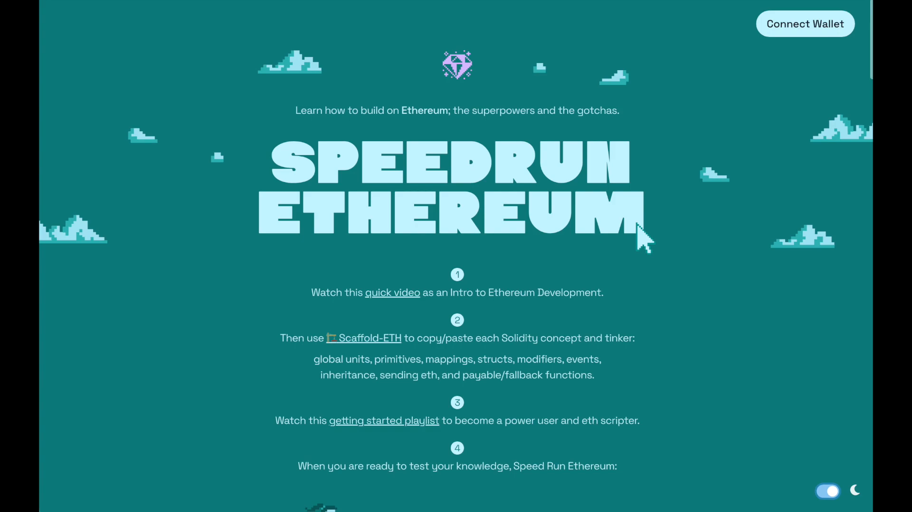

# AI and Forums

The barrier for entry into the world of software and blockchain engineering is smaller than ever. Inevitably we're going to run into problems while coding and knowing where and how to find solutions is an extremely valuable skill.

Here are the exact 6 steps to solve any problem you may face.

1. Tinker
2. Ask Your AI
3. Read Docs
4. Web Search
5. Ask in a Forum
6. Ask on the Support Forum or GitHub
7. Iterate

Lets go through them.

## Tinker
Pinpoint your error, review your code manually making small adjustments you suspect may resolve the issue. Pinpointing the error in your code will help you frame your question/prompt in the next step.

>> Once you've spotted the issue you can craft better questions for the AI, and even potentially solve your error without AI intervetion.

## Ask Your AI
There are several AI models available these days, each with their pros and cons. Here are a few to consider.

- ChatGPT - The OG. This model offered by OpenAI is robust, multi-modal, includes code interpretation and can browse the web. The best quality unfortunately comes from the paid version.

- Phind - This is a programming focused model with intuition allowing it to proactively ask questions to clarify assumptions. Can also browse the web, and has a VS Code extension!

- Copilot - formerly Bing Chat, and not to be confused with the IDE AI assistant, Copilot is rapidly becoming Microsoft's whole ecosystem response to the age of AI

- Google Gemini (Formerly Bard) - results may vary

There are 6 principles to prompt engineering to get the best out of your AI.

- Principle 1: Write clear and specific instructions

- Principle 2: Give as much context as possible

- Principle 3: Use delimiters to clearly indicate distinct parts of the input

- Principle 4: Look out for hallucinations

- Principle 5: Understand the limitations of the model - many have strict context token limits (though this is rapidly changing)

- Principle 6: Iterate constantly

> Hallucinations are when an AI provides a response that it thinks is correct, but is wrong. These can be hard to spot and require a little experience to call out.

Asking questions is a skill, so keep practicing. There's a great free course at [learn.deeplearning.ai](https://learn.deeplearning.ai/) that can help software engineers become better prompt engineers.

## Read Docs
If a problem is occurring with a particular implementation, framework, language - whatever - you can almost always read the documentation for further insight and examples of how to accomplish your goals.

> You can even use AI to help you here by copying docs as context into a model like ChatGPT and asking questions to it

## Web Search
Something many AIs are lacking is the ability to retrieve up to date information, or they're limited by not having access to the web. This is where good ol' fashioned web search comes in.

If you're running into an issue, it's highly likely someone else has to, and search engines like Google have already indexed these questions to serve their answers to you.

> Note: AI Models are advancing rapidly and many models as of Dec 2023 also include web search.

## Ask in a Forum
Sometimes the information we need just isn't out there and we're forced to interact with human beings

We always want to ask our questions in a web-indexed forum which will allow search engines and future AI models to index this new information. A few examples are:

- Ethereum Stack Exchange - a community-driven question-and-answer platform dedicated to Ethereum, and blockchain technology

- Stack Overflow - online platform that facilitates knowledge exchange and problem-solving within the global programming and software development community

- Peera - Peera is a decentralized knowledge sharing platform built on web3 technology, particularly blockchain

- Reddit - Reddit is a widely popular and diverse social media platform that serves as a hub for online communities, discussions, and content sharing

Questions asked on Discord and Twitter are likely to get buried in their conversational chaos and will never be indexed, so use these avenues sparingly.

> The super secret alpha is to post your question on a forum like Stack Exchange, then link to that question in your Discord message!

Always remember to format your questions using markdown when appropriate.

## Ask on the Support GitHub or Forum
If the tool you're using isn't open source - maybe reconsider how necessary it is! Haha

Open source projects on GitHub allow people to submit improvements and raise issues, this is how we improve our code.

## Iterate
Repeat the above steps again and again.

## General Tips
The above are a number of effective steps to overcome issues you'll have while learning. Here are a few additional general tips to keep in mind:

1. Limit self-triage to 15/20 minutes - don't force yourself to struggle through solving an issue alone. There are countless tools available to assist in focusing on where the error is and how to solve it

2. Don't be afraid to ask AI, but don't skip learning - AI is going to `hallucinate` it's going to get things wrong. It's only by learning and understanding the underlying concepts that someone will be able to spot these errors and inconsistencies

3. Use the Forums!!! - Asking questions in the GitHub discussions and on forums is a great way to find support - and helping others with their problems is a great way to reinforce what you've learnt

4. Google the exact error - A problem you're having is likely to have been faced by someone else. Leverage search engines to find past solutions

5. Make Accounts on Stack Exchange and Peera - These communities are invaluable to assist with Web3 software engineering and coding problems. Use them.

6. Post Issues on GitHub/Git - Interacting with the community is an integral part of the Web3 and software development communities. Open source projects allow the submission of `Issues` and `Pull Requests` on GitHub. Be respectful, but if you're unable to find answers, or believe you're hitting a bug in a protocol - creating issues is a great way to bring these problems to a project's attention.

> Be sure to search for already open issues before submitting a new one to an open source project.

***

# Triage

To get the most out of this course's tools and techniques, we've got some tips and tricks for you. In this lesson, we'll go over some recommended best practices:

## Limit Self-Triage Time
When encountering an error, limit your troubleshooting time to 15-20 minutes. For example, if you are trying to compile `PriceConverter.sol` and keep receiving an error indicating a missing argument, spend a limited amount of time attempting to solve it on your own. If you can't resolve it after 15-20 minutes, copy the error message and use your resources to ask for help.

## Utilize AI Wisely
While AI tools like ChatGPT can be very helpful, it's important not to rely on them entirely. It's crucial to learn the material yourself first and recognize when AI makes mistakes, also known as hallucinations. For instance, if you ask ChatGPT about [Foundry](https://getfoundry.sh/introduction/installation/#using-foundryup), it might provide inaccurate information because it may not be trained on it. Always verify AI responses with additional research.

## Engage with Forums
When you're stuck on an issue you can't solve, you can visit forum platforms like Stack Exchange or [Peera](https://app.peera.ai/) to ask questions, help others, and learn collaboratively. Ensure your questions are well-formatted using Markdown to improve clarity and the chances of getting helpful responses. If you need guidance on how to format questions, use AI to ask examples of well-formatted queries.

## GitHub Issues
If you can't get help elsewhere, you can open an Github Issue in the [GitHub's Issue Tracker](https://github.com/Cyfrin/remix-fund-me-cu/issues?q=is%3Aissue). This section allows you to interact with the developer community, report bugs, and suggest enhancements. Remember to always search within existing issues before posting to avoid duplicates.

GitHub is essential for sharing, writing, and interacting with fellow developers, as well as accessing and contributing to code. We will use it as a portfolio for our projects throughout the courses. This portfolio will become very valuable when applying for jobs, because it easily showcase your coding skills and contributions to open-source projects.

# Setting up Github

You know 

# Formatting a question

We'll be covering the importance of well crafted questions and how to properly format our inquires to give them the best chance of receiving a response.

## The Art of Asking Questions

A good example would be:

"I am receiving this error when compiling.":

```bash
TypeError: Exactly one argument expected for explicit type conversion.
--> PriceConvertor.sol:21:43:
|
21|    AggregatorV3Interface priceFeed = AggregatorV3Interface()
|
```

Here's my code:

```solidity
AggregatorV3Interface priceFeed = AggregatorV3Interface()
```

Could someone please help me figure out what the issue is? 🙏

Quite simply, we can take the following necessary steps while crafting our questions:

1. Describe the issue clearly and concisely - Be clear in the problem you're facing and what steps got you there

2. Highlight the specific error you're experiencing - including exact error messages can provide those helping you with valuable insight into where things went wrong

3. Use markdown for code formatting - this is critical, formatting your code allows your question to be more readable and approachable for those trying to understand the problem

4. Share the relevant part of the code causing the issue - only include what's relevant to your issue. Don't paste a whole contract into your question unless appropriate to do so. You can provide too much information.

With a well formatted question, you're going to see a much higher rate of success in receiving help from others as well as AI.

> The importance of markdown formatting cannot be stressed enough. If you're unfamiliar with markdown, don't hesitate to ask an AI like ChatGPT for advice, or to format things for you.

## Wrapping Up
Always remember, there are no bad questions but there are poorly formatted questions. Make your questions count and format them appropriately.

A pillar of becoming a software engineer is being involved in these communities. Jump in and participate, ask questions and meet people. Contribution is the cornerstone of open source communities. Do your best to answer as many questions as you ask, this will reinforce your knowledge.

> You don't have to be an expert to help those on the journey behind you.

# Speedrun Ethereum

In this section we're examining a resource that isn't explicitly part of this course but is highly useful in expanding your knowledge about Ethereum and the Ethereum Virtual Machine (EVM). This resource comes courtesy of my good friend Austin Griffin. Let's go over what it can do for you.



# Introduction to Speedrun Ethereum w/ Austin Griffin
Austin Griffin, renowned for his conspicuous bow tie, is eager to help you kickstart your journey of creating on Ethereum through [speedrunethereum.com](https://speedrunethereum.com/). He's developed this resource to clarify the ‘HOW’ and ‘WHY’ behind Ethereum building.

Through Speedrun Ethereum, you'll delve into a plethora of projects, including:

- Creating a simple Non-Fungible Token (NFT)

- Constructing a decentralized staking app

- Developing a token vendor

- Building a Dice Game - learning about randomness on chain

- Creating a Decentralized Exchange (Dex)

- Constructing and using a MultiSig Wallet

- SVG NFTs and on chain Data

...and much more

> Speedrun Ethereum is not about the procedure, it also demystifies the reasoning behing these processes

To take advantage of these learning opportunities, visit [speedrunethereum.com](https://speedrunethereum.com/) and get started!.

## Intro to Scaffold-ETH2
Scaffold-eth-2 is a great resource for those learning Solidity and trying to visualize what their code is doing.

It provides a clean front-end UI that will update dynamically with your smart contract changes, allowing you to interact with it and monitor adjustments you've made.


## Final Remarks
Leverage the knowledge and resources provided by speedrun ethereum and Scaffold ETH to equip you in building innovative solutions on Ethereum. With determined effort and continuous learning, you're sure to make significant strides in the blockchain ecosystem.

## Congratulations!
You did it. That's all for this section - you should be incredibly proud. Take a break and rest up, cause you're ready to move on to [Foundry Fundamentals!](https://updraft.cyfrin.io/courses/foundry)
